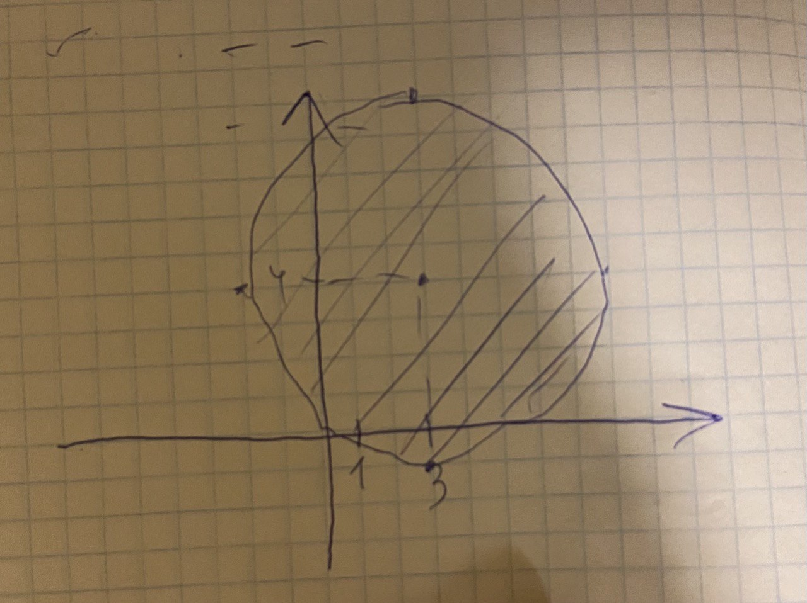
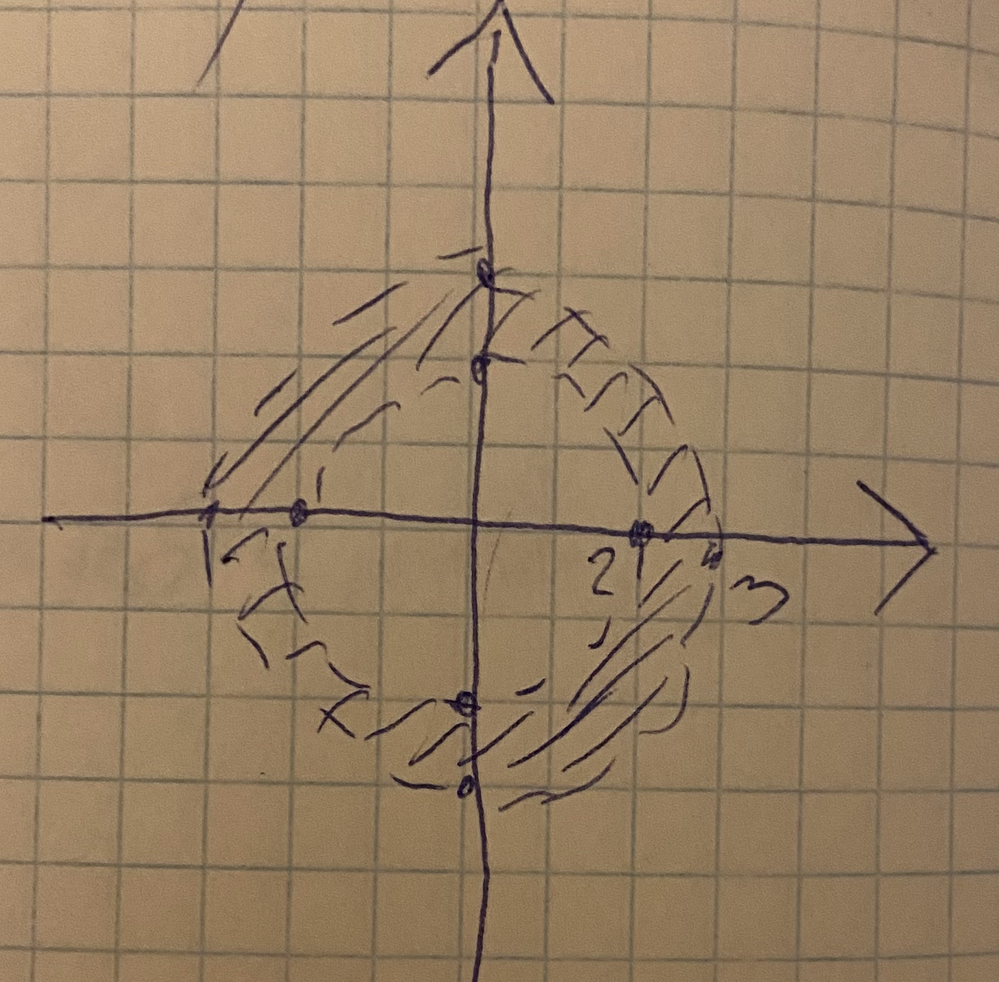

# DZ

## 1
$\frac{(1+3i)(8-i)}{(2+i)^2} = \frac{8-i+24i-3i^2}{4+4i+i^2} = \frac{(11+23i)(3-4i)}{(3+4i)(3-4i)} = \frac{33-44i+69i-92i^2}{9-16i^2} = \frac{125+25i}{25}=5+i$

## 2
$(2+i)x +(1+2i)y = 1 -4i$

$2x+ix + y +2iy = 1-4i$

$(2x+y-1) + i(x+2y+4) =0$

$\begin{cases}
2x+y = 1 \\\\
x+2y =-4
\end{cases}$

$y=1-2x$

$x+2(1-2x)=-4$

$-3x+2=-4$

$x=2$

$y=-3$

## 3

a) $-3i = 3(0-i) = 3(cos\frac{3\pi}{2}+isin\frac{3\pi}{2})$

b) $1+i = \sqrt2(cos{\frac{\pi}{4}}+isin\frac{\pi}{4})$

c) $1-i = \sqrt2(cos{\frac{-\pi}{4}}+isin\frac{-\pi}{4})$

## 4

a)
$1+i\sqrt3=2(cos\frac{\pi}{3}+ isin\frac{\pi}{3})$

b) $-1 - i\sqrt3 = 2(cos\frac{-2\pi}{3} + isin\frac{-2\pi}{3})$

c)
$1 -i\sqrt3 = 2(cos\frac{-\pi}{3}+isin\frac{-\pi}{3})$

d)
$-\sqrt3+i=2(cos\frac{5\pi}{6}+isin\frac{5\pi}{6})$

e)

$1+i\frac{\sqrt3}{3}$

пусть $k$ - коэффициент на который надо домножить оба слагаемых чтобы получилась пара косинуса и синуса:

$cos\alpha = k*1, sin\alpha =k\frac{\sqrt3}{3}$

по основному тригонометрическому тождеству:

$k^2+(\frac{k\sqrt3}{3})^2=1$

$k^2(1+\frac{1}{9})=1$

$k^2 = \frac{9}{10}$

$k = \sqrt{\frac{9}{10}}$

теперь:

$1+i\frac{\sqrt3}{3} = \frac{1}{k}(cos(arcos(k))+isin(arcsin(k\frac{\sqrt3}{3}))$

## 5

$sin\alpha + icos\alpha  = cos(\alpha -\frac{\pi}{2}) -isin(\alpha - \frac{\pi}{2})$

но при этом:

$(cosx-isinx)(cosx+isinx)=cos^2x-isin^2x=cos^2x+sin^2x=1$

значит: 

$cos(\alpha -\frac{\pi}{2})+isin(\alpha-\frac{\pi}{2}) = \frac{1}{cos(\alpha -\frac{\pi}{2}) -isin(\alpha - \frac{\pi}{2})}$

## 6

$1 +cos\phi +isin\phi $

пусть $k$ - коэффициент на который надо домножить оба слагаемых чтобы получилась пара косинуса и синуса:

$cos\alpha = k(1+cos\phi), sin\alpha =ksin\phi$

по основному тригонометрическому тождеству:

$k^2(1+2cos\phi +cos^2\phi) + k^2sin^2\phi=1$

$k^2 (1+ 2cos\phi + cos^2\phi + sin^2\phi)=1$

$k^2(2+2cos\phi)=1$

$k = \sqrt\frac{1}{2(1+cos\phi)}$

теперь: 

$1 +cos\phi +isin\phi  = \frac{1}{k}(cos(arcos(k(1+cos\phi))+isin(arksin(sin\phi))))$

## 7

$|z+3+4i|\leq 5$

## 8
$2<|z|<3$

