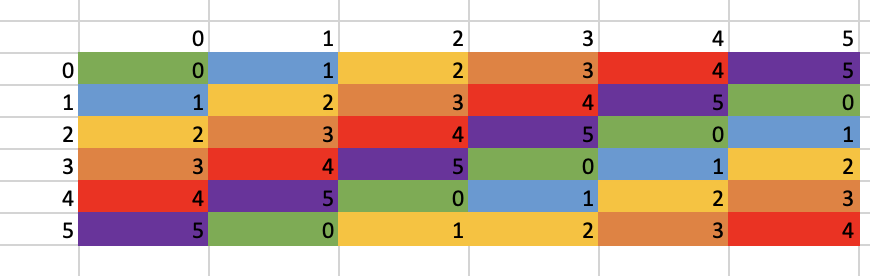

# dz 20

## 1

$Z_6 \times Z_{36} = (Z_3\times Z_2)\times(Z_4\times Z_9) = (Z_3\times Z_4)\times (Z_2\times Z_9) = Z_{12}\times Z_{18}$

## 2

допустим $d=(a,b,c)$

$ord(d) = НОК(ord(a),ord(b),ord(c))$

так как мы хотим порядок 6, то $ord(c)=3\implies c=1\lor c=2$

и $НОК(ord(a),ord(b))=2$, значит $a$ может быть любым, а $b$ только четным, но пара $a=0\land b=0$ не подходит

итого (2 пары $a$ * 2 пары $b$ - 1) * 2 пары $c$ = 6

ответ 6

## 3

$H = \begin{Bmatrix}(0,0),(3,2)\end{Bmatrix}$

$bH = \begin{Bmatrix}(2,3),(5,1)\end{Bmatrix}$

$(bH)^n = bHbH\dots bH = b^nH=(nb)H$

$nb = (0,0)$

$n = НОК(ord(2),ord(3)) = НОК(3,4) = 12$

## 4

пусть $H$ - нормальая подгруппа

по т. Лагранжа $|A_5|mod|H|=0$

$|A_5|=60$

а нормальная группа это всегда обьеденение каких-то классов сопряженности и $id$

$60mod|1+12|\neq0$

$60mod|1+15|\neq0$

$60mod|1+20|\neq0$

$60mod|1+12+12|\neq0$

$60mod|1+12+15|\neq0$

и тем более при $|H|>30$

тогда по т. Лагранжа не являетс нормальной подгруппой значит $A_5$ простая

## 5
Таблица Кели

$Z_6 = <1> = <5>$ значит только 2 автоморфизма

$f(x)=x$

$f(x)=-x$

