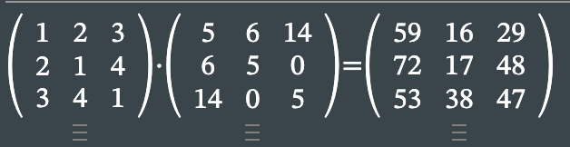

# dz 21

## 1

$nZ$ - это подмножество $Z$, которое является кольцом, значит все свойства наследуются, следует только проверить корректность операций

$na+nb=n(a+b)$ сложение корректно

$na * nb = n^2ab = n(nab)$ умножение корректно

кольцо
## 2

нет, потому что нет обратных чисел у сложению у большинства чисел

## 3

$\frac{n}{a}+\frac{n}{b} = \frac{na+nb}{ab} = \frac{n(a+b)}{ab}$, но совсем не всегда $a+b$ делит $ab$, а значит операция сложения некорректна

## 4

$\frac{a}{b} + \frac{c}{d} = \frac{ad+cb}{bd}$ так как $b$ и $d$ не делятся на простое число, то и  $bd$ не делится, сложение корректно

умножение тоже

дистрибутивность

$\frac{a}{b}(\frac{c}{d}+\frac{e}{f}) = \frac{a}{b}(\frac{cf+de}{df})=\frac{acf+ade}{bdf}$ корректна

значит кольцо

## 5

$\frac{p-2}{p}+\frac{2}{p} = \frac{p}{p}=\frac{1}{1}$

кольцо

## 6

это кольцо изоморфно паре целых чисел, а целые числа - кольцо, значит и это множество с операциями кольцо

## 7

умножение не корректно 

пример 

## 8

операция сложения очевидно корректно

при перемножении верхнетреугольниъ матриц выходит тоже верхнетреуголбная

дистрибутивность:

$\begin{pmatrix}
a_1&b_1\\\\
0&c_1
\end{pmatrix}\times(
    \begin{pmatrix}
a_2&b_2\\\\
0&c_2
\end{pmatrix}\ +
\begin{pmatrix}
a_3&b_3\\\\
0&c_3
\end{pmatrix}\
) = $

$\begin{pmatrix}
a_1&b_1\\\\
0&c_1
\end{pmatrix}\times
    \begin{pmatrix}
a_2+a_3&b_2+b_3\\\\
0&c_2+c_3
\end{pmatrix}\ 
 = $

 $\begin{pmatrix}
a_1(a_2+a_3)&b_1(b_2+b_3)\\\\
0&c_1(c_2+c_3)
\end{pmatrix}\  = $

$\begin{pmatrix}
a_1&b_1\\\\
0&c_1
\end{pmatrix}\times \begin{pmatrix}
a_2&b_2\\\\
0&c_2
\end{pmatrix} +
\begin{pmatrix}
a_1&b_1\\\\
0&c_1
\end{pmatrix}\times
\begin{pmatrix}
a_3&b_3\\\\
0&c_3
\end{pmatrix}\
$

а с учетом свойства

$\begin{pmatrix}
A&B\\\\
0&C
\end{pmatrix}\times
\begin{pmatrix}
D&E\\\\
0&F
\end{pmatrix} = 
\begin{pmatrix}
AD&AE+BF\\\\
0&CF
\end{pmatrix}$
дистрибутивность сохраняется для любых $n$

## 9

$h(x) = f(x)+g(x)$

$h''(x) = f''(x) + g''(x)$

сумма корректна

$h(x) = f(x)g(x)$

$h'(x) = f'(x)g(x)+ f(x)g'(x)$

$h''(x) = f''(x)g(x) + f'(x)g'(x) + f'(x)g'(x) + f(x)g''(x) = f''(x)g(x) + 2f'(x)g'(x) + f(x)g''(x)$

перемножение корректно

$h(x)(g(x)+f(x)) = h(x)g(x) + h(x)f(x)$

дистрибутивность работает

## 10

рассмотрим перемножение

$(3+sinx))(sin3x) = 3sin3x+sinxsin3x = 
3sin3x+\frac{1}{2}(cos(-2x)-cos4x)$

умножение некорректно

## 11

операции корректны

дистрибутивность:

$A\cap((B/C)\cup(C/B))=A\cap(B/C)\cup A\cap(C/B)$

выполняется

значит кольцо

## 12

допустим $x$ левый делитель нуля и обратим слева, тогда

$yxz$

такое что $xz=0$ и  $yx=1$, тогда с одной стороны

$yxz = y0=0$

а с другой

$yxz=1z=z$, при том что $z\neq 0$

противоречие

## 13

$f(x) = c$

необратимая и не делитель нуля

## 14
$\begin{pmatrix}
a&b\\\\
0&0
\end{pmatrix} 
\begin{pmatrix}
c&d\\\\
0&e
\end{pmatrix}= 
\begin{pmatrix}
ac&ad+be\\\\
0&0
\end{pmatrix}$, где

$c=0\land b = -\frac{ad}{e}$

$\begin{pmatrix}
0&a\\\\
0&b
\end{pmatrix} 
\begin{pmatrix}
c&d\\\\
0&e
\end{pmatrix}=\begin{pmatrix}
0&ae\\\\
0&be
\end{pmatrix}$, где $e=0$

допустим существует другой правый делитель нуля тогда

$\begin{pmatrix}
a&b\\\\
0&c
\end{pmatrix}
\begin{pmatrix}
d&e\\\\
0&f
\end{pmatrix} = 
\begin{pmatrix}
ad&ae+bf\\\\
0&cf
\end{pmatrix}$

$\begin{cases}
ad=0\\\\
ae+bf=0\\\\
cf=0
\end{cases}$

нет другого решения, кроме $a=0\lor c=0$

## 15

допустим есть элемент

$A = \begin{pmatrix}
a&b\\\\
0&c
\end{pmatrix}$ 

$A^2 = \begin{pmatrix}
a^2&ab+bc\\\\
0&c^2
\end{pmatrix} $

$A^3 = \begin{pmatrix}
a^3&a^2b+abc+bc^2\\\\
0&c^3
\end{pmatrix}$

$A^4 = 
\begin{pmatrix}
a^4&a^3b+a^2bc+abc^2+bc^3\\\\
0&c^4
\end{pmatrix}$

и так далее, вообщем матрица должна иметь вид

$\begin{pmatrix}
0&b\\\\
0&0
\end{pmatrix}$