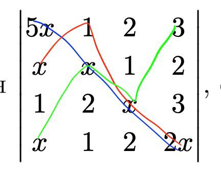

# ДЗ 4

## 1
$(n+1)(n-1) - n^2 = n^2 -1 - n^2 = -1$
## 2
$(\frac{1 - t^2}{1+ t^2})^2 + \frac {4t^2}{(1+t^2)^2} = \frac{1- 2t^2 + t^4 +4t^2}{(1+t^2)^2}=\frac{t^4 +2t^2+1}{t^4 +2t^2+1}=1$

## 3 
$\begin{vmatrix}
4 & -3 & 5 \\\\
3& -2 & 8 \\\\
1&-7&-5
\end{vmatrix} =$
 $(4 * -2 * -5)  + (5*3*-7) + (1* -3 * 8) - (5*-2*1 )- (-5*3*-3) - (4*  -7 * 8)= 40 + -105 + -24- -10 - 45 - -224=100$

## 4
$\begin{vmatrix}
1&1&1 \\\\
1&2&3 \\\\
1&3&6
\end{vmatrix} = 
\begin{vmatrix}
1&1&1 \\\\
0&1&2 \\\\
0&2&5
\end{vmatrix} =
\begin{vmatrix}
1&1&-1 \\\\
0&1&0 \\\\
0&2&1
\end{vmatrix} = 
-\begin{vmatrix}
1&-1&1 \\\\
0&0&1 \\\\
0&1&2
\end{vmatrix} = 
\begin{vmatrix}
1&-1&1 \\\\
0&1&2 \\\\
0&0&1
\end{vmatrix}=1
$
## 5 
$
\begin{vmatrix}
1&1&1 \\\\
4&5&9 \\\\
16&25&81
\end{vmatrix}=
\begin{vmatrix}
1&1&1 \\\\
4&5&9 \\\\
0&5&45
\end{vmatrix} =
\begin{vmatrix}
1&1&1 \\\\
0&1&5 \\\\
0&5&45
\end{vmatrix} =
\begin{vmatrix}
1&1&1 \\\\
0&1&5 \\\\
0&0&20
\end{vmatrix} = 20$

## 6
0, так как третий столбец это 1 столбец намноженный на константу

## 7
$\begin{vmatrix}
a_{1,1}& a_{1,2}&a_{1,3}&a_{1,4} \\\\
a_{2,1}& a_{2,2}&a_{2,3}&a_{2,4} \\\\
a_{3,1}& a_{3,2}&a_{3,3}&a_{3,4} \\\\
a_{4,1}& a_{4,2}&a_{4,3}&a_{4,4} 
\end{vmatrix}$

Все члены с $a_{3,2}$:

1)$a_{1,1} a_{3,2} a_{2,3} a_{4,4}$

2)$a_{1,1} a_{3,2} a_{4,3} a_{2,4}$

3)$a_{2,1} a_{3,2} a_{1,3} a_{4,4}$

4)$a_{2,1} a_{3,2} a_{4,3} a_{1,4}$

5)$a_{4,1} a_{3,2} a_{1,3} a_{2,4}$

6)$a_{4,1} a_{3,2} a_{2,3} a_{1,4}$

Из них положительные : 
2), 3), 6)

## 8 
$10x^4, -2x^3 , -3x^3$

## 9 
Зная свойство : Умножение всех элементов строки или столбца определителя на некоторое число λ равносильно умножению определителя на это число. Значит мы $n$ раз вынесем -1, значит определитель изменится в $(-1)^n$ раз

## 10
придется переставить столбики $n-1$ раз, значит определитель изменится в $(-1)^{n-1}$ раз

## 11

Чтобы получить матрицу повернутую на 90 градусов, нужно транспонировать ее и отзеркалить строки относительно центра, тогда определитель изменится в $ (-1)^{\lfloor \frac{n}{2}\rfloor }$ раз

## 12

$\begin{vmatrix}
0& 1&1&1\\\\
1&0&1&1\\\\
1&1&0&1\\\\
1&1&1&0
\end{vmatrix} = 
-\begin{vmatrix}
1&1&1&0\\\\
1&0&1&1\\\\
1&1&0&1\\\\
0&1&1&1
\end{vmatrix}=
-\begin{vmatrix}
1&1&1&0\\\\
0&-1&0&1\\\\
0&0&-1&1\\\\
0&1&1&1
\end{vmatrix} =
-\begin{vmatrix}
1&1&1&0\\\\
0&-1&0&1\\\\
0&0&-1&1\\\\
0&0&1&2
\end{vmatrix}=
-\begin{vmatrix}
1&1&1&0\\\\
0&-1&0&1\\\\
0&0&-1&1\\\\
0&0&0&3
\end{vmatrix}=-3$

## 13
Произведение входит в определитель, так как никакая строка и никакой столбец не повторяются в произведении дважды

Рассмотрим подстановку:

$\begin{bmatrix}
1&2&3&4&5&6&\dots&3n-2&3n-1&3n \\\\
3&2&1&6&5&4&\dots&3n&3n-1&3n-2
\end{bmatrix}$

Тогда инверсий в подстановке : $3n$, значит при четных $n$ произведение будет положительно, а при нечетных отрицательно

## 14
$\begin{vmatrix}
a_1& a_2&a_3 \\\\
a_4&a_5&a_6 \\\\
a_7&a_8&a_9
\end{vmatrix} =$

$a_1*a_5*a_9 + a_7 * a_2*a_6 + a_3*a_4*a_8 - a_3*a_5*a_7  - a_9*a_4*a_2 - a_1 *a_8*a_6$

1)заметим, что разные множители одночлена одного знака состоит в разных одночленах другого знака

Допустим ответ 6, значит каждой одночлен должен быть равным 1, значит в каждом из отрицательных одночленов должно быть 1 или 3 отрицательных единицы.

``Пусть в первом отрицательном одночлене 1 отрицательное значение``, значит в каком-то из положительных одночленов, в котором есть это значение должно быть еще одно отрицательное значение, тогда по 1) другой отрицательный одночлен содержит как минимум 1 отрицательное значение. 

Если в нем другие два значение отрицательны, то два остальных положительных одночлена по 1) должны содержать еще по одному отрицательному значению, причем эти значения не должны быть в первом отрицательном одночлене, значит они оба в третем отрицательном одночлене, но тогда он должен иметь еще одно отрицательное значение, но тогда какой-то положительный одночлен станет отрицательным. Противоречие.

рассмотрим случай когда другие два значения отрицательны. Тогда в третем отрицательном одночлене может быть либо 1 либо 3 отрицательных числа. В обоих случаях хотябы 1 положительный одночлен становится отрицательным.

``Тогда в первом отриццательном одночлене три отрицательных числа``, значит в каждом положительном одночлене должно быть по еще 1 отрицательному числу, тогда в кажлом из них должно быть по еще одному отрицательному числу, тогда другие два отрицательных одночлена становятся отрицательными.

Тогда ответ 4, приведу пример :

$\begin{vmatrix}
1&1&1\\\\
1&-1&1\\\\
1&1&-1
\end{vmatrix}$

## П65
тяжело...

## П68
Заметим что $\epsilon^3=1$:

$(-\frac{1}{2}+ i\frac{\sqrt{3}}{2})^3=\frac{-1 +3i\sqrt{3} +9 - 3i\sqrt3}{8}=\frac{8}{8}=1$

Тогда $det = 1+\epsilon^3 + \epsilon^6 - \epsilon^3 -\epsilon^3 -\epsilon^3 =0 $