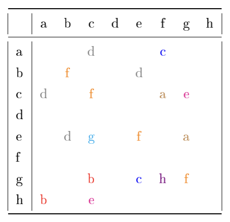
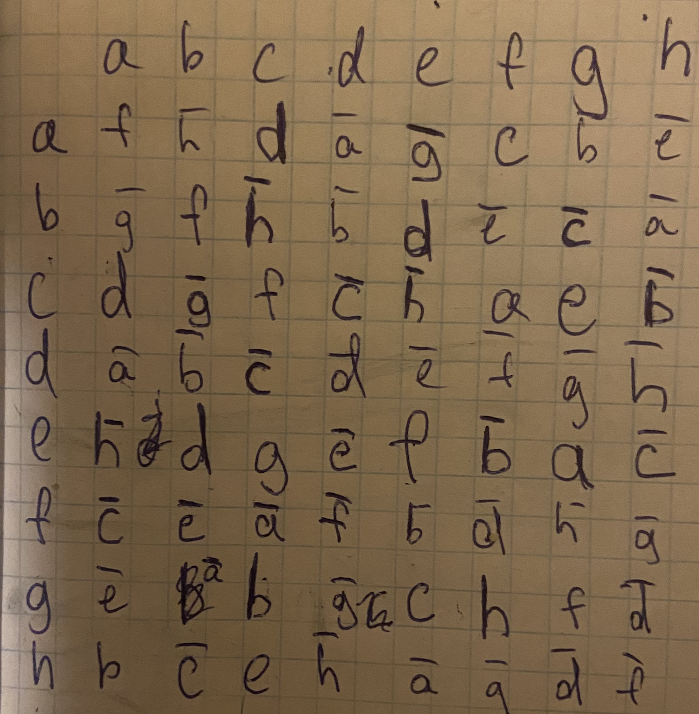

# IDZ 3

## 1

### 1)

так как любая подгруппа циклической подгруппы сама циклическая подгруппа, чтобы подгруппа не оказалась самой группой $G$, нужно чтобы она состояла только из таких элементов $\forall h \in H : h^q=e,$ где $НОД(q,390)\neq 1$ 

$390 = 2\times3\times5\times13$

тогда подгруппами будут :

$G_2,G_3,G_5,G_6,G_{10},G_{13},G_{15},G_{26},G_{30},G_{39},G_{65},G_{78},G_{130},G_{195},G_{390}$

### 2)

$G=<a>$

тогда такие элементы что, $g^{195}=1$

это элементы: $a^2,a^4,a^6\dots a^{388}$, так как

$(a^{2k})^{195}=a^{390k}=1^k=1$

### 3)

только $\forall g \in G \exists ! k:g=a^k$

тогда порядок элемента равен $390/k$

значит есть единственный такой элемент порядка $195:a^2$

### 4)

по следствию теоремы Лагранжа порядок любого элемента конечной группы делит порядок этой группы,

значит в циклической подгруппе нет элемента порядка 196

## 2

$4=2\times 2$

порядок тройки элементов $(a,b,c)\in D_3\times S_4\times Z_4$ равен НОК(порядок a, порядок b, порядок c)

в $D_3$ есть элементы порядков $1,2,3,3,6,6$

в $S_4$ есть 1 элемент порядка 1, 10 элементов порядка 2, 4 элемента порядка 3, 1 элемент порядка 4

в $Z_4$ есть элементы порядка $1,2,4,4$

ответ : $2\times 2\times 1 + 2\times 11\times 2=48$

## 3

$\begin{pmatrix}
18&11&15&10\\\\
1&16&10&12\\\\
8&8&10&13\\\\
11&11&18&6
\end{pmatrix}
\begin{bmatrix}
17+19r^1\\\\
1+19r^2\\\\
14+19r^3\\\\
18+19r^4
\end{bmatrix} = 
\begin{pmatrix}
-1&-8&-4&-9\\\\
1&-3&-9&-7\\\\
8&8&-9&-6\\\\
-8&-8&-1&6
\end{pmatrix}
\begin{bmatrix}
-2+19r^1\\\\
1+19r^2\\\\
-5+19r^3\\\\
-1+19r^4
\end{bmatrix} = 
\begin{pmatrix}
1&-3&-9&-7\\\\
0&8&6&-7\\\\
0&-11&-13&-16\\\\
0&0&-10&0
\end{pmatrix}
\begin{bmatrix}
1+19r^2\\\\
-1+19r^1\\\\
-1+19r^3\\\\
-6+19r^4
\end{bmatrix} = $

$
\begin{pmatrix}
1&-3&-9&-7\\\\
0&8&6&-7\\\\
0&8&6&3\\\\
0&0&-10&0
\end{pmatrix}
\begin{bmatrix}
1+19r^2\\\\
-1+19r^1\\\\
-1+19r^3\\\\
-6+19r^4
\end{bmatrix} = $

$\begin{pmatrix}
1&-3&-9&-7\\\\
0&8&6&-7\\\\
0&0&-10&0\\\\
0&0&0&4
\end{pmatrix}
\begin{bmatrix}
1+19r^2\\\\
-1+19r^1\\\\
-6+19r^4\\\\
19r^3
\end{bmatrix} = $

слау совместна

$4x_4=19r^3\to x_4=0(mod19)$

$8x_3=-6+19r^4\to x_3=4(mod19)$

$8x_2+6*4-7*0=-1+19r_1\to8x_2=-6+19r_1\to x_2=4$

$x_1-3*4-9*4=1+19r^2\to x_1=11+19r^2\to x_1=11$

частное решение в векторном виде : 

$X=\begin{pmatrix}11,4,4,0\end{pmatrix}$

для однородной слау:

$\begin{cases}
x_1=3x_2+9x_3+7x_4\\\\
8x_2 = -6x_3+7x_4\\\\
x_3=x_3\\\\
x_4=x_4
\end{cases}$

ФСР = $\begin{pmatrix}1\\\\-1\\\\-6\\\\0\end{pmatrix}+\begin{pmatrix}3x_2+9x_3+7x_4\\\\ \frac{-6x_3+7x_4}{8}\\\\x_3\\\\x_4\end{pmatrix} = $

$
\begin{pmatrix}1\\\\-1\\\\-6\\\\0\end{pmatrix}+\begin{pmatrix}3x_2+9x_3+7x_4\\\\ 4x_3+8x_4\\\\x_3\\\\x_4\end{pmatrix} = $

$
\begin{pmatrix}1\\\\-1\\\\-6\\\\0\end{pmatrix}+\begin{pmatrix}3(4x_3+8x_4)+9x_3+7x_4\\\\ 4x_3+8x_4\\\\x_3\\\\x_4\end{pmatrix} = $

$
\begin{pmatrix}1\\\\-1\\\\-6\\\\0\end{pmatrix}+\begin{pmatrix}2x_3+12x_4\\\\ 4x_3+8x_4\\\\x_3\\\\x_4\end{pmatrix} = $

$
\begin{pmatrix}1\\\\-1\\\\-6\\\\0\end{pmatrix}+x_3\begin{pmatrix}2\\\\ 4\\\\1\\\\0\end{pmatrix} 
+x_4\begin{pmatrix}12\\\\ 8\\\\0\\\\1\end{pmatrix}$

## 4

для дешифровки используется формула $M \equiv Mg^{tx}*(g^t)^{-x}$

так как $Mg^{tx}*(g^t)^{-x} \equiv Mg^{tx}g^{-tx}=M$

вначале найдем $g^{tx}\equiv(g^t)^x\equiv(28)^{29}\equiv928074647171094496152036391094208962756608\equiv 75$

теперь $(g^{t})^{-x}\equiv (g^{tx})^{-1}\equiv 75^{-1}\equiv 31$

тогда $M\equiv Mg^{tx}*(g^t)^{-x}\equiv 74 *31\equiv 2294\equiv 53$

ответ 53

## 5

вначале поделим $f$ на $g$ с остатоком

$\frac{f(x)}{g(x)} = 6x+3 +\dfrac{-6x^4-7x^3-3x^2-x+6}{g(x)}$

$p(x)=6x+3$

найдем корни $g(x):$

$g(x) = 5(x-1)(x-4)(x-6)(x-7)(x-16)$

$\dfrac{-6x^4-7x^3-3x^2-x+6}{5(x-1)(x-4)(x-6)(x-7)(x-16)}=\dfrac{A_1}{5x-5}+\dfrac{A_2}{x-4}+\dfrac{A_3}{x-6}+\dfrac{A_4}{x-7}+\dfrac{A_5}{x-16}=$

$\frac{A_1(x-4)(x-6)(x-7)(x-16)+5A_2(x-1)(x-6)(x-7)(x-16)+5A_3(x-1)(x-4)(x-7)(x-16)+5A_4(x-1)(x-4)(x-6)(x-16)+5A_5(x-1)(x-4)(x-6)(x-7)}{5(x-1)(x-4)(x-6)(x-7)(x-16)} = $

$\frac{x^4(A_1+5A_2+5A_3+5A_4+5A_5)+x^3(-33A_1-150A_2-140A_3-135A_4-90A_5)+x^2(366A_1+1395A_2+1155A_3+1050A_4+555A_5)+x(-1672A_1-4610A_2-3260A_3-2840A_4-1310A_5)+(2688A_1+3360A_2+2240A_3+1920A_4+840A_5)}{5(x-1)(x-4)(x-6)(x-7)(x-16)} = $

$\frac{x^4(A_1+5A_2+5A_3+5A_4+5A_5)+x^3(1A_1+3A_2-4A_3+1A_4-5A_5)+x^2(9A_1+1A_2-1A_3-4A_4-6A_5)+x(-6A_1-3A_2+4A_3-1A_4-1A_5)+(2A_1-6A_2-4A_3-1A_4+7A_5)}{5(x-1)(x-4)(x-6)(x-7)(x-16)} $

по методу неопределенных коэффициентов

$\begin{cases}
A_1+5A_2+5A_3+5A_4+5A_5=-6\\\\
A_1+3A_2-4A_3+A_4-5A_5=-7\\\\
9A_1+A_2-A_3-4A_4-6A_5=-3\\\\
-6A_1-3A_2+4A_3-A_4-A-5\\\\
2A_1-6A_2-4A_3-A_4+7A-5=6
\end{cases}$

решим слау получим

$A = \begin{pmatrix}-4\\\\-3\\\\8\\\\-1\\\\-1\end{pmatrix}$

тогда получилосб

$\dfrac{f(x)}{g(x)} = 6x+3-\dfrac{4}{5x-5}-\dfrac{3}{x-4}+\dfrac{8}{x-6}-\dfrac{1}{x-7}-\dfrac{1}{x-16}$

## 6

$f(x)=2x^4+4x^2+1$

найдем корни:

перебором подошли 4 корня $1,2,5,6$

значит $f(x)=2(x-1)(x-2)(x-5)(x-6)$

$g(x)=5x^4+6x^2+3$

найдем корни:

перебором подошли 4 корня $1,3,4,6$

значит $g(x)=-2(x-1)(x-3)(x-4)(x-6)$

тогда НОД двух многочленов $НОД=2(x-1)(x+1)=2x^2-2$

получается

$u(x)(2x^4+4x^2+1)+v(x)(5x^4+6x^2+3)=2x^2-2$

допустим $u(x)=С$ и $v(x)=C$

тогда пусть $u(x)=a$ а $v(x)=b$

раскроем скобки

$2ax^4+4ax^2+a+5bx^4+6bx^2+3b=2x^2-2$

по методу неопределенных коэффициентов

$\begin{cases}
2a+5b\equiv0\\\\
4a+6b=2\\\\
a+3b\equiv -2
\end{cases}$

$1)2a+5b\equiv 2a-2b\equiv 0\to a\equiv b$

$3)a+3b\equiv 4a\equiv -2\to a\equiv3\to b\equiv3$

$2)4\times 3+6\times 3\equiv 12+18\equiv 30\equiv 2$

подошло

тогда ответ $u(x)=v(x)=3$

## 7

раскроем первое перемножение: 

$(4x^4+3x^3+5x^2+2x)(4x^2+6x+3) = $

$16x^6 + 24x^5 +14x^4 + 12x^5 + 9x^3 + 20x^4 + 30x^3 + 3x^2+8x^3+12x^2+6x = $

$2x^6+x^5+x^4+5x^3+x^2+6x$

второе перемножение

$(5x^5+5x^4+2x^3+2x^2+3x+3)(x+1) = $

$5x^6 + 5x^5 + 2x^4 + 2x^3 +3x^2 + 3x+ 5x^5 +5x^4 + 2x^3 + 2x^2 + 3x+3 = $

$5x^6+3x^5+4x^3 + 5x^2 + 6x$

теперь сложим получившиеся

$S = 4x^5+x^4+2x^3+6x^2+5x+3$

теперь посчитаем дробь

$\frac{5x^2+x+6}{6x+1}=2x+1 + \frac{5}{6x+1}$

заметим что

$x^4+2x^3+x^2+3x+4 = (6x+1)(6x^3+4x^2+3x)+4$

тогда

$\frac{5}{6x+1}\equiv\frac{5(6x^3+4x^2+3x)}{4}\equiv\frac{2x^3+6x^2+x}{4}\equiv 4x^3+5x^2+2x$

тогда сложим все получившеемя

$S' = S+2x+1 + 4x^3+5x^2+2x\equiv 4x^5+x^4+6x^3+4x^2+2x+4$

найдем остаток при делении на модуль и получим ответ:

$2x^3+6x^2+4+<x^4+2x^3+x^2+3x+4>$

## 8

рассмотрим вначале сложение

1) операция определена - очевидно
2) Сложение матриц ассоциативно
3) существует нейтральный элемент - нулевая матрица
4) обратный : 
для каждой матрицы $A$ есть матрица $A'=-1\times A$
5) коммутативность сложение наследуется из сложения обычных матриц
умножение

$\begin{pmatrix}
x_1&0&0&0\\\\
x_2&x_1&0&0\\\\
0&0&x_3&x_4\\\\
0&0&0&x_3
\end{pmatrix}
\begin{pmatrix}
y_1&0&0&0\\\\
y_2&y_1&0&0\\\\
0&0&y_3&y_4\\\\
0&0&0&y_3
\end{pmatrix} = 
\begin{pmatrix}
x_1y_1&0&0&0\\\\
x_2y_1+x_1y_2&x_1y_1&0&0\\\\
0&0&x_3y_3&x_3y_4+x_4y_3\\\\
0&0&0&x_3y_3
\end{pmatrix}$

операция корректна

ассоциативность умножения наследуется из обысного умножения матриц 

дистрибутивность :
проверяем - подходит

значит кольцо

### делители нуля

заметим что умножение коммутативно, поэтому будем искать только левый делитель нуля

$\begin{pmatrix}
x_1&0&0&0\\\\
x_2&x_1&0&0\\\\
0&0&x_3&x_4\\\\
0&0&0&x_3
\end{pmatrix}
\begin{pmatrix}
y_1&0&0&0\\\\
y_2&y_1&0&0\\\\
0&0&y_3&y_4\\\\
0&0&0&y_3
\end{pmatrix} = 
\begin{pmatrix}
x_1y_1&0&0&0\\\\
x_2y_1+x_1y_2&x_1y_1&0&0\\\\
0&0&x_3y_3&x_3y_4+x_4y_3\\\\
0&0&0&x_3y_3
\end{pmatrix}$

$\begin{cases}
x_1y_1=0\\\\
x_2y_1+x_1y_2=0\\\\
x_3y_3=0\\\\
x_3y_4+x_4y_3=0
\end{cases}$

несчитая решения где все иксы или все игрики нулевые есть решения с точностью до симметрии

$\begin{pmatrix}
x_1\\\\x_2\\\\x_3\\\\x_4\\\\
y_1\\\\y_2\\\\y_3\\\\y_4
\end{pmatrix} =
\begin{pmatrix}
0\\\\0\\\\0\\\\x_4\\\\
y_1\\\\y_2\\\\0\\\\y_4
\end{pmatrix};
\begin{pmatrix}
0\\\\0\\\\x_3\\\\x_4\\\\
y_1\\\\y_2\\\\0\\\\0
\end{pmatrix};
\begin{pmatrix}
0\\\\x_2\\\\0\\\\0\\\\
0\\\\y_2\\\\y_3\\\\y_4
\end{pmatrix};
\begin{pmatrix}
0\\\\x_2\\\\0\\\\x_4\\\\
0\\\\y_2\\\\0\\\\y_4
\end{pmatrix} $

тогда делителями нуля будут соответствуеюшие этим решениям матрицы

## 9

т.к. порядок $S_2\times D_4$ равен $2*8=16$ тогда по теореме Кэли есть изоморфизм между $S_2\times D_2$ и какой-то подгруппой $S_{16}$

пронумеруем все наши элементы группы $S_2\times D_4$ в зависимости от их номера(начиная с 1) в массиве

$[(id,R_0),(id,R_{90}),(id,R_{180}),(id,R_{270}),(id,u_1),(id,u_2),(id,u_3),(id,u_4),((12),R_0),((12),R_{90}),((12),R_{180}),((12),R_{270}),((12),u_1),((12),u_2),((12),u_3),((12),u_4)]$

теперь проведем операцию с нужным нам $((12),R_{270})$:

$((12),R_{270})(id,R_0)=((12),R_{270}),1\to12$

$((12),R_{270})(id,R_{90})=((12),R_{0}),2\to9$

$((12),R_{270})(id,R_{180})=((12),R_{90}),3\to10$

$((12),R_{270})(id,R_{270})=((12),R_{180}),4\to11$

$((12),R_{270})(id,u_1)=((12),u_4),5\to16$

$((12),R_{270})(id,u_2)=((12),u_1),6\to13$

$((12),R_{270})(id,u_3)=((12),u_2),7\to14$

$((12),R_{270})(id,u_4)=((12),u_3),8\to15$

$((12),R_{270})((12),R_0)=(id,R_{270}),9\to4$

$((12),R_{270})((12),R_{90})=(id,R_{0}),10\to1$

$((12),R_{270})((12),R_{180})=(id,R_{90}),11\to2$

$((12),R_{270})((12),R_{270})=(id,R_{180}),12\to3$

$((12),R_{270})((12),u_1)=(id,u_4),13\to8$

$((12),R_{270})((12),u_2)=(id,u_1),14\to5$

$((12),R_{270})((12),u_3)=(id,u_2),15\to6$

$((12),R_{270})((12),u_4)=(id,u_3),16\to7$

таким образом проведение этой операции можно записать как подстановку

$\sigma(((12),R_{270}))=\begin{pmatrix}
1&2&3&4&5&6&7&8&9&10&11&12&13&14&15&16\\\\
12&9&10&11&16&13&14&15&4&1&2&3&8&5&6&7
\end{pmatrix} = (1,12,3,10)(2,9,4,11)(5,16,7,14)(6,13,8,15)$

ответ выше

## 10

$ae=(eg)e=e(ge)=ec=g$

$bc=(gc)c=g(cc)=gf=h$

$bg=(gc)g=g(cg)=ge=c$

$cb=c(gc)=(cg)c=ec=g$

$ce=(ge)e=g(ee)=gf=h$

$ea=(hc)a=h(ca)=hd=h(ac)=(ha)c=bc=h$

$ch = c(bc)=(cb)c=gc=b$

$cd = c(be)=(cb)e=ge=c$

$ed=e(ac)=(ea)c=hc=e$

$ef=e(cc)=(ec)c=gc=b$

$eh = e(gf)=(eg)f=af=c$

$fa=(ee)a=e(ea)=eh=c$

$fb=(ee)b=e(eb)=ed=e$

$fc=(ee)c=e(ec)=eg=a$

$fd=(ee)d=e(ed)=ee=f$

$fe=eee=ef=b$

$ff=eef=eb=d$

$fg=eeg=ea=h$

$fh=eeh=ec=g$

$ga=eca=ed=e$

$gb = ecb=eg=a$

$gd=ecd=ec=g$

$gh=ech=eb=d$

$hb=gfb=ge=c$

$hd=gfd=gf=h$

$he=gfe=gb=a$

$hf=gff=gd=g$

$hg=gfg=gh=d$

$hh=gfh=gg=f$

$aa=fca=fd=f$

$ab=fcb=fg=h$

$ad=fcd=fc=a$

$ag=fcg=fe=b$

$ah=fch=fb=e$

$ba=efa=ec=g$

$bd=efd=ef=b$

$bf=eff=ed=e$

$bh=efh=eg=a$

$da=caa=cf=a$

$dd=cad=ca=d$

$de=cae=cg=e$

$df=caf=cc=f$

$dg=cag=cb=g$

$dh=cah=ce=h$

итог:

нетрудно заметить что это перемешанная таблица кэли для группы кватернионов $Q$