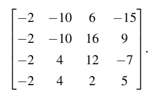
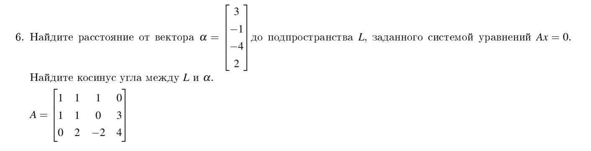
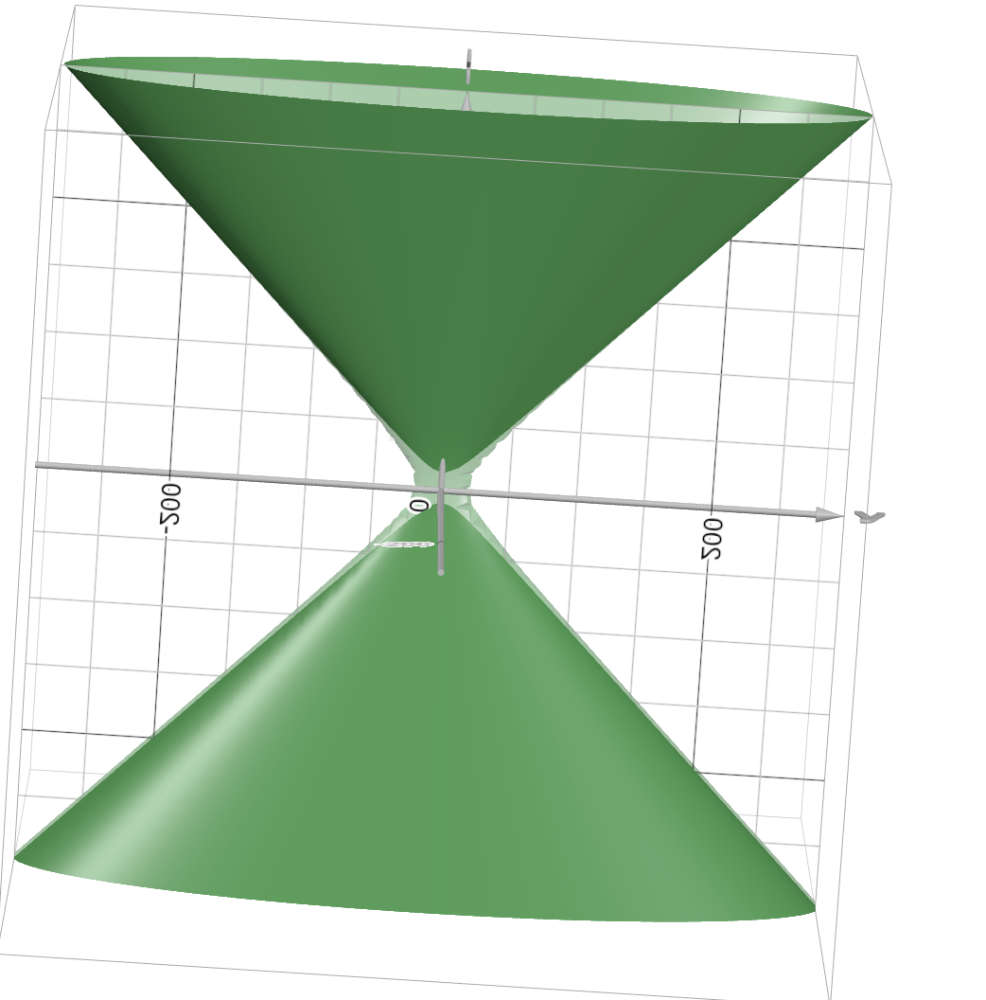
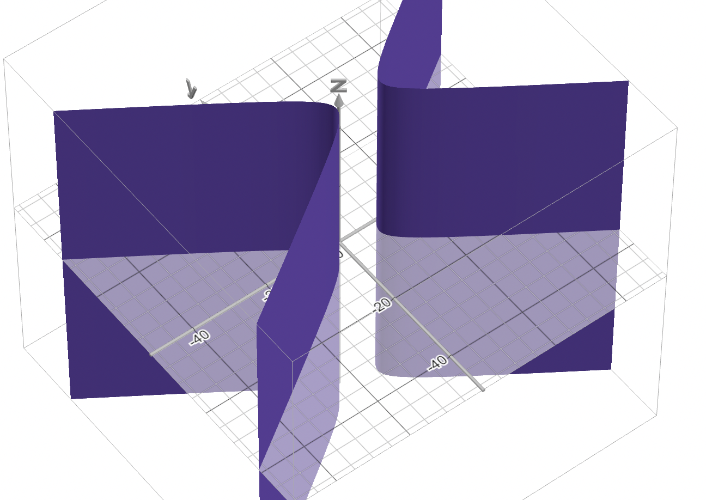
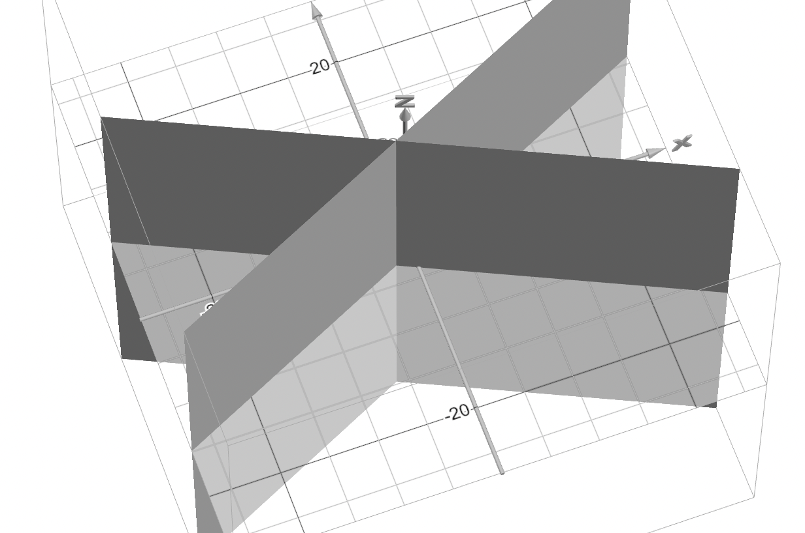

# IDZ 4 вариант 2

## 10

$A = U\Sigma V^T$

посчитаем $AA^T =$

$\begin{pmatrix}
850&-850&-174&174\\\\
-850&850&174&-174\\\\
-174&174&850&-850\\\\
174&-174&-850&850
\end{pmatrix}$

у нее собственные числа:

$2048 : (1 ,-1, -1 ,1)^T$

$1352 : (-1,1,-1,1)^T$

$0 : (1,1,0,0)^T$

$0 : (0,0,1,1)^T$

сингулярные числа:

$\sigma_1 = 32\sqrt2$

$\sigma_2 = 26\sqrt2$

тогда матрица

$\Sigma = \begin{pmatrix}
32\sqrt2&0&0&0\\\
0&26\sqrt2&0&0
\end{pmatrix}$

построим матрицу $V^T$ из собственных веекторов

$\begin{pmatrix}
\frac{1}{2}&-\frac{1}{2}&\frac{\sqrt2}{2}&0\\\\
-\frac{1}{2}&\frac{1}{2}&\frac{\sqrt2}{2}&0\\\\
-\frac{1}{2}&-\frac{1}{2}&0&\frac{\sqrt2}{2}\\\\
\frac{1}{2}&\frac{1}{2}&0&\frac{\sqrt2}{2}
\end{pmatrix}$

теперь находим матрицу U оп формуле

$u_i=\frac{Av_i}{\sigma_i}$

$u_1=(\frac{\sqrt2}{2},\frac{\sqrt2}{2})$

$u_2 = (-\frac{\sqrt2}{2},\frac{\sqrt2}{2})$

$U = \begin{pmatrix}
\frac{\sqrt2}{2}&-\frac{\sqrt2}{2}\\\\
\frac{\sqrt2}{2}&\frac{\sqrt2}{2}
\end{pmatrix}$

тогда получилось

$A=
\begin{pmatrix}
\frac{\sqrt2}{2}&-\frac{\sqrt2}{2}\\\\
\frac{\sqrt2}{2}&\frac{\sqrt2}{2}
\end{pmatrix}
\begin{pmatrix}
32\sqrt2&0&0&0\\\
0&26\sqrt2&0&0
\end{pmatrix}
\begin{pmatrix}
\frac{1}{2}&-\frac{1}{2}&\frac{\sqrt2}{2}&0\\\\
-\frac{1}{2}&\frac{1}{2}&\frac{\sqrt2}{2}&0\\\\
-\frac{1}{2}&-\frac{1}{2}&0&\frac{\sqrt2}{2}\\\\
\frac{1}{2}&\frac{1}{2}&0&\frac{\sqrt2}{2}
\end{pmatrix}$

теперь 

$B = $

$\begin{pmatrix}
\frac{\sqrt2}{2}&-\frac{\sqrt2}{2}\\\\
\frac{\sqrt2}{2}&\frac{\sqrt2}{2}
\end{pmatrix}
\begin{pmatrix}
32\sqrt2&0&0&0\\\
0&0&0&0
\end{pmatrix}
\begin{pmatrix}
\frac{1}{2}&-\frac{1}{2}&\frac{\sqrt2}{2}&0\\\\
-\frac{1}{2}&\frac{1}{2}&\frac{\sqrt2}{2}&0\\\\
-\frac{1}{2}&-\frac{1}{2}&0&\frac{\sqrt2}{2}\\\\
\frac{1}{2}&\frac{1}{2}&0&\frac{\sqrt2}{2}
\end{pmatrix}$

посчитаем

$=\begin{pmatrix}
32&0&0&0\\\\
32&0&0&0
\end{pmatrix}V^T=$

$\begin{pmatrix}
16&-16&16\sqrt2&0\\\\
-16&16&16\sqrt2&0
\end{pmatrix}$

## 1

у нас есть уравнения

$a_1X=b_1$

$a_2X=b_2$

$a_3X=b_3$

$a_4X=b_4$

каждое из них содержит 4 линейных уравнения на 12 одинаковых для всех неизвестных

всего 16 уравнений

составим слау

$\begin{cases}
3x_{11}-4x_{21}+4x_{31}=3\\\\
3x_{12}-4x_{22}+4x_{32}=6\\\\
3x_{13}-4x_{23}+4x_{33}=-3\\\\
3x_{14}-4x_{24}+4x_{34}=9\\\\
-8x_{11}-2x_{21}+6x_{31}=-4\\\\
-8x_{12}-2x_{22}+6x_{32}=-8\\\\
-8x_{13}-2x_{23}+6x_{33}=4\\\\
-8x_{14}-2x_{24}+6x_{34}=-12\\\\
-6x_{11}+x_{21}-x_{31}=-6\\\\
-6x_{12}+x_{22}-x_{32}=-12\\\\
-6x_{13}+x_{23}-x_{33}=6\\\\
-6x_{14}+x_{24}-x_{34}=-18\\\\
2x_{11}+4x_{21}-5x_{31}=1\\\\
2x_{12}+4x_{22}-5x_{32}=2\\\\
2x_{13}+4x_{23}-5x_{33}=-1\\\\
2x_{14}+4x_{24}-5x_{34}=3\\\\
\end{cases}$

решаем методом гаусса и получаем

$X=\begin{pmatrix}
1&2&-1&3\\\\
1&2&-1&3\\\\
1&2&-1&3
\end{pmatrix}$

найдем размерность ядра

$a\begin{pmatrix}
1&2&-1&3\\\\
1&2&-1&3\\\\
1&2&-1&3
\end{pmatrix}=0$

$a_1+a_2+a_3=0$

разменость 2, т.к. две переменные свободные и третья меняется чтобы сумма была 0

размерность образа 4, т. к. для любого $b$

$a\begin{pmatrix}
1&2&-1&3\\\\
1&2&-1&3\\\\
1&2&-1&3
\end{pmatrix}=b$

$\exists a = \begin{pmatrix}b_1/3&b_2/6&-b_3/3&b_4/3\end{pmatrix}$

## 2

запишим матрицы квадратичных форм

$Q_1 = \begin{pmatrix}
-50&-30&-10\\\\
-30&-26&-18\\\\
-10&-18&-20
\end{pmatrix}$

применим метод симметричного Гаусса

$\begin{pmatrix}
-50&-30&-10\\\\
-30&-26&-18\\\\
-10&-18&-20
\end{pmatrix}\to
\begin{pmatrix}
-50&0&-10\\\\
0&-8&-12\\\\
-10&-12&-20
\end{pmatrix}\to$
$\begin{pmatrix}
-50&0&0\\\\
0&-8&-12\\\\
0&-12&-18
\end{pmatrix}\to$

$\begin{pmatrix}
-50&0&0\\\\
0&-8&0\\\\
0&0&0
\end{pmatrix}$

отрицательный индекс инерции : 2
положительный 0

матрица перехода к базису сроится через матрицы элементарных преобразований

$\begin{pmatrix}
1&0&0\\\\
-3/5&1&0\\\\
0&0&1
\end{pmatrix}
\begin{pmatrix}
1&0&0\\\\
0&1&0\\\\
-1/5&0&1
\end{pmatrix}\begin{pmatrix}
1&0&0\\\\
0&1&0\\\\
0&-3/2&1
\end{pmatrix}
\begin{pmatrix}
1&0&0\\\\
0&1&-3/2\\\\
0&0&1
\end{pmatrix}
\begin{pmatrix}
1&0&-1/5\\\\
0&1&0\\\\
0&0&1
\end{pmatrix}
\begin{pmatrix}
1&-3/5&0\\\\
0&1&0\\\\
0&0&1
\end{pmatrix}$

$=\begin{pmatrix}
1&-3/5&-1/5\\\\
-3/5&1&-3/2\\\\
-1/5&-3/2&1
\end{pmatrix}$

квадратичная форма отрицательно определена

не существует базиса перехода к $Q_2$ так как у квадратичных форм разные индексы инерции

## 3

$(x,y)A=(x-3y,2x-2y)=x-3y+2i(x-y)$

найдем собственные значения:

$\begin{vmatrix}
1-\lambda&2\\\\
-3&-2-\lambda
\end{vmatrix}=0$

$-(1-\lambda)(2+\lambda)+6=0$

$\lambda^2+\lambda+4=0$

нет решений над $R$

значит нет базиса в котором линейный оператор имеет диагональный вид.

## 4

матрица оператора дня:

пусть у нас вектор
$\begin{pmatrix}здоровые&легко&тяжело\end{pmatrix}$

тогда матрица оператора дня:

$\begin{pmatrix}
0.3&0.3&0.4\\\
0.14&0.76&0.1\\\
0.14&0.36&0.5
\end{pmatrix}$

найдем к чему сремится:

найдем такой вектор, при применении к которому оператора ничего не изменится (собственный вектор с собств. значением 1)

заметим что вектор $(2,7,3)$ как раз такой

тогда население страны будет коллинеарным этому вектору

$(1270,4445,1905)$

## 5

найдем при помощи Грамма-Шмидта

$b_1 = a_1$

$b_2 = a_2 - \frac{(a_2,b_1)}{(b_1,b_1)}b_1 = (-10,-10,4,4) - \frac{3}{4}b_1=(-7,-7,7,7)$

$b_3 = a_3 - \frac{(a_3,b_1)}{(b_1,b_1)}b_1 - \frac{(a_3,b_2)}{(b_2,b_2)}b_2 = (-5,5,5,-5)$

$b_4 = (-9,9,-9,9)$

нормируем и получаем матрицу $Q$

$\begin{pmatrix}
-\frac12&-\frac12&-\frac12&-\frac12\\\\
-\frac12&-\frac12&\frac12&\frac12\\\\
-\frac12&\frac12&\frac12&-\frac12\\\\
-\frac12&\frac12&-\frac12&\frac12
\end{pmatrix}$

теперь найдем $R = Q^{-1}A=Q^TA$

$R = \begin{pmatrix}
4&6&-18&4\\\\
0&14&-4&2\\\\
0&0&10&6\\\\
0&0&0&8
\end{pmatrix}$

## 6

найдем вначале подпрастранство

$\begin{cases}
x_1+x_2+x_3=0\\\\
x_1+x_2+3x_4\\\\
2x_2-2x_3+x_4=0
\end{cases}$

ФСР:

$x_4\begin{pmatrix}
-11/2\\\\
5/2\\\\
3\\\\
1
\end{pmatrix}$

тогда

$L=<\begin{pmatrix}
-11\\\\
5\\\\
6\\\\
2
\end{pmatrix}>$

$pr_L \alpha = \frac{(\alpha,l)}{(l,l)}l=\frac{-29}{93}l = (\frac{319}{93},-\frac{145}{93},-\frac{58}{31},-\frac{58}{93})$

$ort \alpha = \alpha - pr_L\alpha = (-\frac{40}{93},\frac{52}{93},-\frac{66}{31},-\frac{138}{93})$

$cos = \frac{||pr_L \alpha||}{||\alpha||} = \frac{69803}{129735}$

## 7

найдем $a = x_2-x_1 = $

$\begin{pmatrix}
1&2\\\\
0&1
\end{pmatrix}$

распишем Фробениусово скалаярное произведение

$Tr(B^TA) = b_{11}a_{11}+b_{21}a_{21}+b_{12}a_{12}+b_{22}a_{22}$

получилось скалярное произведение в некотором ОНБ

то есть это пространство $U$ изоморфно векторному пространству с ОНБ $U'$

c изоморфизмом

$\begin{pmatrix}
a_{11}&a_{12}\\\\
a_{21}&a_{22}
\end{pmatrix}_U\to$

$\begin{pmatrix}
a_{11}\\\\ a_{12} \\\\ a_{21} \\\\ a_{22}
\end{pmatrix}$

давайте найдем $L_1+L_2$

$\begin{pmatrix}
0&1&0&-2\\\
2&1&0&-1\\\
-1&-1&-2&0
\end{pmatrix}\to$

$\begin{pmatrix}
1&1&2&0\\\
2&1&0&-1\\\
0&1&0&-2
\end{pmatrix}\to$

$\begin{pmatrix}
1&1&2&0\\\
0&-1&-4&-1\\\
0&1&0&-2
\end{pmatrix}\to$

$\begin{pmatrix}
1&1&2&0\\\
0&1&0&-2\\\
0&0&-4&-3
\end{pmatrix}\to$

$\begin{pmatrix}
1&1&2&0\\\
0&1&0&-2\\\
0&0&1&\frac{3}{4}
\end{pmatrix}\to$

$\begin{pmatrix}
1&0&0&\frac{1}{2}\\\
0&1&0&-2\\\
0&0&1&\frac{3}{4}
\end{pmatrix}$

$(\frac12,-2,\frac34,1)\to(2,-8,3,4)$ -   базис в $L_1+L_2$

$(x_2-x_1)^{\perp}_{L_1+L_2} = xe$

$x = \frac{(a,e)}{(e,e)} = \frac{2-16+4}{4+64+9+16}=-\frac{10}{93}$

$p^2 = ||ort_{L_2+L_1}a|| =x^2||(a,a)|| = \frac{200}{2883}$

$p = \frac{10\sqrt{6}}{93}$

## 11

### a)

$−x^2+4x+ y^2−2y+9z^2−72z+132= 0$
 
 $−(x-2)^2 + 4+ (y-1)^2 - 1+(3z^2−24)^2 - 576+132= 0$

  $−(x-2)^2+ (y-1)^2 +(3z^2−24)^2 = 441$

  $−\frac{(x-2)^2}{441}+ \frac{(y-1)^2}{441} +\frac{(3z−24)^2}{441} = 1$

  значит это уравнение однополосного гиперболойда

 

  однополосный гиперболоид делит пространство на 2 части

  ### b)

$4x^2+24x−9y^2−54y−189= 0$

$(2x+6)^2-36 -(3y+9)^2+81-189=0$

$\frac{(2x-6)^2}{144} - \frac{(3y+9)^2}{144} = 1$

это парабола в 2д, а при расширении в 3д становится 
гиперболическим цилиндром, делящим пространство на 3 части

### c)

$x^2+4x−9y^2−54y+ z^2+4z−73= 0$

$(x+2)^2-4-(3y+9)^2+81+(x+2)^2-4-73=0$

$(x+2)^2-(3y+9)^2+(x+2)^2=0$

две скрещивающиеся плоскости делят пространство на 4 части

