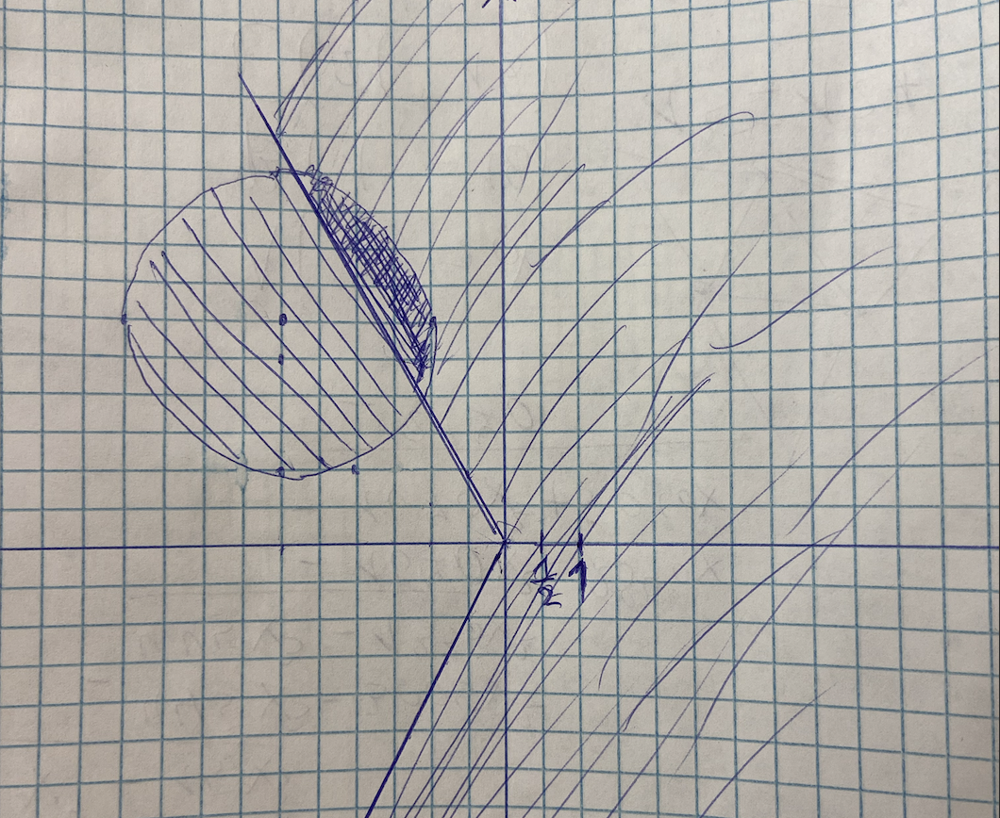

# IDZ вариант 2

## 1

$z = \frac{\sqrt3+i}{2} = cos\frac{\pi+ 12\pi k}{6}+isin\frac{\pi+ 12\pi k}{6}$

$z^{3/7} = cos\frac{\pi+ 12\pi k}{14}+ isin\frac{\pi + 12\pi}{14}$

при этом 

$\frac{z^{3/7}}{4z} = cos\frac{4\pi}{21} + isin \frac{4\pi}{21}$

$\frac{z^{3/7}}{4z} = \frac{cos\frac{\pi+ 12\pi k}{14}+ isin\frac{\pi + 12\pi k}{14}}{4(cos\frac{\pi}{6}+isin\frac{\pi}{6})} =  1/4 (cos\frac{3\pi + 36\pi k - 7\pi }{42} + isin\frac{3\pi + 36\pi k - 7\pi}{42}) = 1/4(cos\frac{-2\pi + 18\pi k}{21}+ isin\frac{-2\pi + 18\pi k}{21})$

$-2\pi + 18\pi k = 4\pi (mod\ 42\pi)$

$18k = 6(mod\ 42)$

$3k=1(mod\ 7)$

$k=5$

Ответ: $cos\frac{61\pi}{14}+isin\frac{61\pi}{14} = cos\frac{5\pi}{14}+ isin\frac{5\pi}{14}$

## 2

$\begin{pmatrix}
10+13i&-7-14i\\\\
-12-9i&-10+11i
\end{pmatrix}
\begin{pmatrix}138-450i\\\\-133+217i\end{pmatrix} 
$

решим Крамером

$\Delta =
\begin{vmatrix}
10+13i&-7-14i\\\\
-12-9i&-10+11i
\end{vmatrix}$ 
$=(10+13i)(-7-14i)-(-12-9i)(-10+11i) = -70 -140i -91i + 182 - 120 + 132i - 90i -99 = -107 -189i$

$\Delta_x = \begin{vmatrix}
138-450i&-7-14i\\\\
-133+217i&-10+11i
\end{vmatrix}$
$= -399+5675i$

$\Delta_y = \begin{vmatrix}
10+13i&138-450i\\\\
-12-9i&-133+217i
\end{vmatrix}$
$=
1555-3717i$

$x=\frac{\Delta_x}{\Delta} = \frac{-399+5675i}{ -107 -189i}$

$y = \frac{\Delta_y}{\Delta} = \frac{1555-3717i}{-107 -189i}$

## 3

$-5x^6 +50x^4+440x^3 -3005x^2+2840x+6240$

поделим многочлен на $(x-3)$

$(x-3)(- 5x^5 - 15x^4 + 5x^3 + 455x^2 - 1640x - 2080)$

так как многочлен состоит из целых коэффициентов и один из корней $x=3−2i$, то существует корень $x=3+2i$

поделим многочлен на $(x-3−2i)(x-3+2i)=x^2-6x+13$

$(x-3)(x-3−2i)(x-3+2i)(- 5x^3 - 45x^2 - 200x - 160)$

поделим многочлен на $(x-4−4i)(x-4+4i)=x^2-8x+32$

$(x-3)(x-3−2i)(x-3+2i)(x-4−4i)(x-4+4i)(-5x-85)$

$-5(x-3)(x-3−2i)(x-3+2i)(x-4−4i)(x-4+4i)(x+17)$

## 4

есть три точки $A(-18;20),B(1;-18),C(21;18)$

нужных нам точек существует 3 

возьмем точку B как соседа для А и С.

$BA = (-19;38)$

$BC = (21;36)$

точка D (четвертая точка параллелограмма) найдется через сумму BА+ВС

$BD=BA+BC = (2;74)$

$D= B + BD =(3;56)$

$z = 3+56i$

## 5

$z_1 = 2(cos\frac{2\pi}{3}+isin\frac{2\pi}{3})$

$z_2 = 2(cos\frac{5\pi}{6}+isin\frac{5\pi}{6})$

$\begin{cases}
\frac{2\pi}{3} = \frac{\alpha \pi }{n} \\\\
\frac{5\pi}{6} = \frac{\alpha\pi +2\pi}{n}
\end{cases}$

$\begin{cases}
\frac{2}{3} = \frac{\alpha  }{n} \\\\
\frac{5}{6} = \frac{\alpha +2}{n}
\end{cases}$

$\begin{cases}
2n=3\alpha \\\\
5n=6\alpha +12
\end{cases}$

$\alpha = 8; n = 12$

$\alpha\pi = \beta\pi + 2\pi k, k\in \Z$

$\beta=0$

$z_1,z_2 = \sqrt[12]{2^{12}(cos0+isin0)}$

$z= 2^{12}=4096$

## 6

сделаем замену $t=z-1$

$\begin{cases}
|t+3 -3i|< 2\\\\
|arg(t)|<\frac{2\pi}{3}
\end{cases}$

## 7

$\begin{cases}
4x_1 -3x_2 +8x_3= \alpha \\\\
-3x_1-8x_2 = \beta \\\\
-x_1-x_2-x_3 = \gamma
\end{cases}$

$\begin{pmatrix}
4&-3&8&\alpha \\\\
-3&-8&0&\beta\\\\
-1&-1&-1&\gamma
\end{pmatrix} = 
\begin{pmatrix}
4&-3&8&\alpha+\beta \\\\
0&-41&24&3\alpha + 4\beta\\\\
0&-1&-1&\gamma
\end{pmatrix} = 
\begin{pmatrix}
4&-3&8&\alpha+\beta \\\\
0&-41&24&3\alpha + 4\beta\\\\
0&-7&-4&\alpha +4\gamma
\end{pmatrix} = 
\begin{pmatrix}
4&-3&8&\alpha+\beta \\\\
0&-41&24&3\alpha + 4\beta\\\\
0&0&-1&5\alpha-7\beta +41\gamma
\end{pmatrix} 
$

$x_3 = -5\alpha+7\beta-41\gamma$

$x_2=-3\alpha+4\beta-24\gamma$

$x_1 = 8\alpha-11\beta+64\gamma$

## 8

Вектор нормали к плоскости

$n=(-6;24;-34)$

сократим

$n=(3;-12;17)$

найдем вектор, что если его прибавить к данной точке, результирующая точка будет лежать в плоскости

$-6(3+ 3k)+ 24(4-12k) -34(-7+17k)+568=0$

$k=1\to n=(3;-12;17)$

тогда если к точке прибавить два вектора нормали результирующая точка будет находится симметрично относительно плоскости

$A_0 = A+ 2n = (3,4,7)+(6;-24;34)= (9;-20;41)$

## 9

У бесконечной призмы линии, образованные пересечением любых двух плоскостей, параллельны

Плоскости :

$L_1 : 2x-y -8z-8=0$

$L_2 : -6x -5y-10z-3=0$

$L_3 : -10x-11y-28z+21=0$

Пересечение 1 и 2 плоскости:

$\begin{cases}
 2x-y -8z=8 \\\\
 -6x -5y-10z=3
\end{cases}$

$\begin{pmatrix}x\\\\ y\\\\ z\end{pmatrix} = 
\begin{pmatrix} 37/16 +15/8z\\\\
-27/8 -17/4z\\\\
z \end{pmatrix}$

Пересечение 2 и 3 плоскости: 

$\begin{cases}
-6x -5y-10z=3\\\\
 -10x-11y-28z=-21
\end{cases}$

$\begin{pmatrix}x\\\\ y\\\\ z\end{pmatrix} = 
\begin{pmatrix} -69/8 +15/8z\\\\
39/4 -17/4z\\\\
z \end{pmatrix}$

Пересечение 1 и 3 плоскости :

$\begin{cases}
 2x-y -8z=8 \\\\
 -10x-11y-28z=-21
\end{cases}$

$\begin{pmatrix}x\\\\ y\\\\ z\end{pmatrix} = 
\begin{pmatrix} 109/32 +15/8z\\\\
-19/16 -17/4z\\\\
z \end{pmatrix}$

Все эти три прямые параллельны, поэтому они никогда не пересекутся в пространстве а значит образуют бесконечную призму.

Найдем нужную плоскость. Так как она параллельна $L_3$ и содержит прямую между $L_1L_2$ совершим подстановку

($C$ константа, чтобы плоскость была параллельна $L_1$)

$-10x-11y-28z+C=0$

$-10(37/16 +15/8z)-11(-27/8 -17/4z)-28z + C=0$

$-370/16-150/8z+297/8 +187/4z - 28z+C=0$

$14+C=0$

$C = -14$

Тогда нужная нам плоскость :

$-10x-11y-28z-14=0$

## 10

найдем уравнения прямых

$L_1$:

$\begin{cases}
15x-6y +23z-66=0\\\\
-15x+32y +29z -38=0
\end{cases}$

$\begin{cases}
x = 27/5 t_1 -142/15\\\\
y =52/3t_1 -104/3 \\\\
z=t_1
\end{cases}$

направляющий вектор : $n_1=(27/5,52/3,1)$

$L_2$ :

$\begin{cases}
-3x+7y +7z+204=0\\\\
-6x+10y+ 7z+270=0
\end{cases}$

$\begin{cases}
x = -25/2-7/4t_2\\\\
y =-69/2 - 7/4 t_2\\\\
z=t_2
\end{cases}$

направляющий вектор : $n_2=(-7/4,-7/4,1)$

векторное произведение направляющих векторов будет перпендикулярно обоим прямым.

$n=[n_1,n_2]$=$(\begin{vmatrix}
52/3&1\\\\-7/4&1
\end{vmatrix},\begin{vmatrix}
1&27/5\\\\1&-7/4
\end{vmatrix},\begin{vmatrix}
27/5&52/3\\\\-7/4&-7/4
\end{vmatrix} ) = (52/3+7/4,-7/4-27/5,-189/20+364/12)
=(229/12,-143/20,1253/60)$

Составим систему

$L_{10}+kn =L_{20}$, где $k$ какое-то число

$\begin{cases}
27/5 t_1 -142/15 + 229/12k=-25/2-7/4t_2\\\\
52/3t_1 -104/3 -143/20k=-69/2 - 7/4 t_2\\\\
t_1 + 1253/60k=t_2
\end{cases}  \implies
\begin{cases}
27/5 t_1 +7/4t_2 + 229/12k = -91/30\\\\
52/3t_1 +7/4t_2 -143/20k=-1/6 \\\\
t_1 + -t_2 +1253/60k=0
\end{cases} \implies
\begin{cases}
324 t_1 +105t_2 + 1145k = -182\\\\
1040t_1 +105t_2 -429k=-10 \\\\
60t_1  -60t_2 +1253k=0
\end{cases}$

$(k,t_1,t_2) = (-\frac{628}{9431},\frac{885}{9431},-\frac{183446}{141465})$

зная $t_1$  можем найти точку и построить прямую по ней и вектору.

$\begin{cases}
x = -25/2+7/4\frac{183446}{141465}\\\\
y =-69/2 + 7/4 \frac{183446}{141465}\\\\
z=-\frac{183446}{141465}
\end{cases}$

$\begin{cases}
x = -25/2+\frac{642061}{282930}\\\\
y =-69/2 + \frac{642061}{282930}\\\\
z=-\frac{183446}{141465}
\end{cases}$

$\begin{cases}
x = -\frac{2894564}{282930}\\\\
y =-\frac{9119024}{282930}\\\\
z=-\frac{183446}{141465}
\end{cases}$

Тогда параметрическое уравнение прямой:

$\begin{cases}
x = -\frac{2894564}{282930} +229/12t\\\\
y =-\frac{9119024}{282930} -143/20t\\\\
z=-\frac{183446}{141465} +1253/60t
\end{cases}$

Cоставим из него каноническое

$\frac{12x+\frac{17367384}{47155}}{229}=
\frac{20y+\frac{18238048}{28293}}{143} =
\frac{60z + \frac{733784}{9431}}{1253}$

