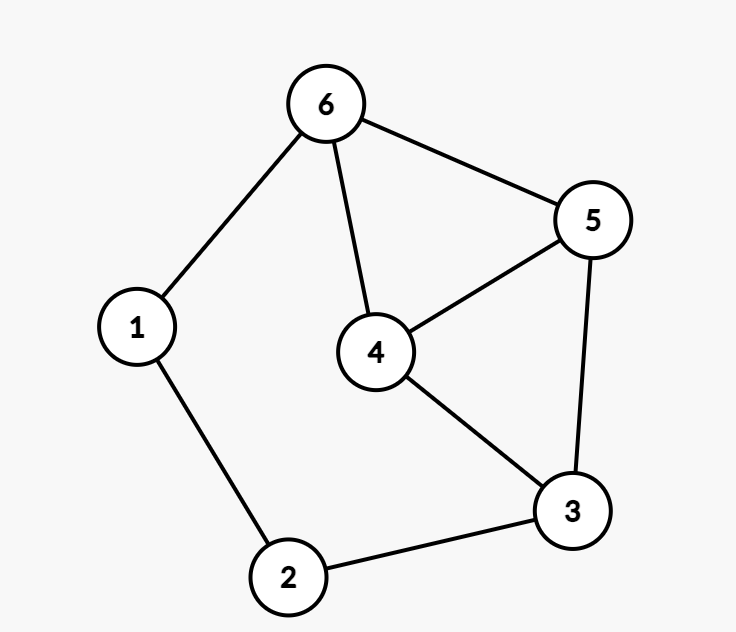
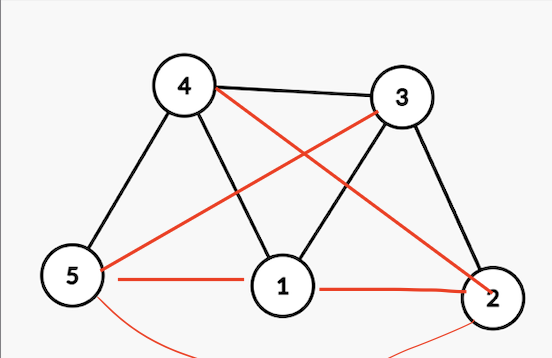
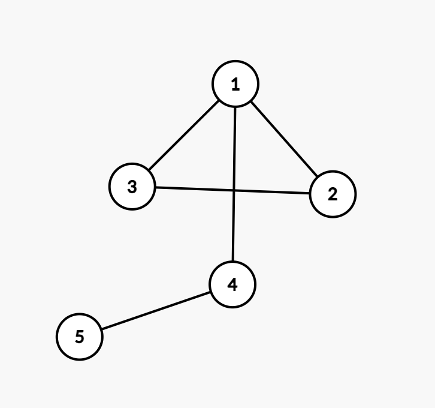

# DZ 14

## 2

### a)

нет

1 вершина имеет степень один, тогда остается 7 вершин, но даже если они будут составлять полный граф, количество ребер будет равно $1+21=22$

### b)

## 2

все графы без ребер

все графы с 1 ребром

все деревья с высотой 1 и одинокими точками

почему не подходят другие:

пусть у нас есть граф с двумя ребрами, такой что он подходит условию

если мы хотим добавить ребро и не пропало условие, надо добавить ребро от той же вершины, которая обьединяет уже существующие два ребра

и так далее

в итоге у нас все ребра будут соединены с единственной точкой, так и получится дерево высоты 1 и отдельные одинокие точки

## 3

$K_3$ это треугольник

посмотрим на случайную вершину $b$ соседа по ребру случайной $a$

чтобы не получился треугольник, $b$ не должен состоять в ребре с 200 оставшимися соседями $a$, однако степень $b$ 201, а не соединенных с $a$ всего 199 штук.

Тогда обязательно будет получаться треугольник, а значит и $K_3$

## 4
$G_1:$
пятиконечная звезда изморфна кольцу, и дополнение звезды тоже кольцо

и такой $G_2:$

## 5

степенная последовательность такого графа должна иметь вид

$(a,b,2,4-b,4-a),a\geq b\geq 2$ чтобы при дополнении последовательность оставалась такой же

попробуем рассмотреть $a$ и $b$ 

$a=4,b=4$ не может быть, потому что в таком случае вершины со степенью 4 должны иметь связи с вершинами степени 0.

$a=4,b=3$ тоже

$a=3,b=3$ это $G_2$. Другого графа с такой последовательностью нет.

$a=3,b=2$ существует только один такой граф:

но его дополнение не равно ему

$a=2,b=2$ это $G_1$. Другого графа с такой последовательностью степеней не существует.

## 6

степенная последовательность обязана иметь вид

если есть вершина степени 50, то и должна юыть вершина степени 49, так что при дополнении они поменялись

однако если между этими двумя вершинами изнасально было ребро, с дополнении его не будет и наоборот. Тогда дополнение не будет изоморфно самому графу

## 7

брат понятие транзитивное, если у человека 3 брата, то он как минимум должен состоять в компоненте связности изоморфной $K_4$

однако из 7 человек нельзя составить две $K_4$, тогда этот граф $K_7$

## 8

выберем один город

определить этот город в одну группу, а остальные города в другую

найдем связь с каким-то городом, закидываем его в 1 группу

делаем так пока не кончатся города

итак во все города из 1 группы можно добрать друг в друга

