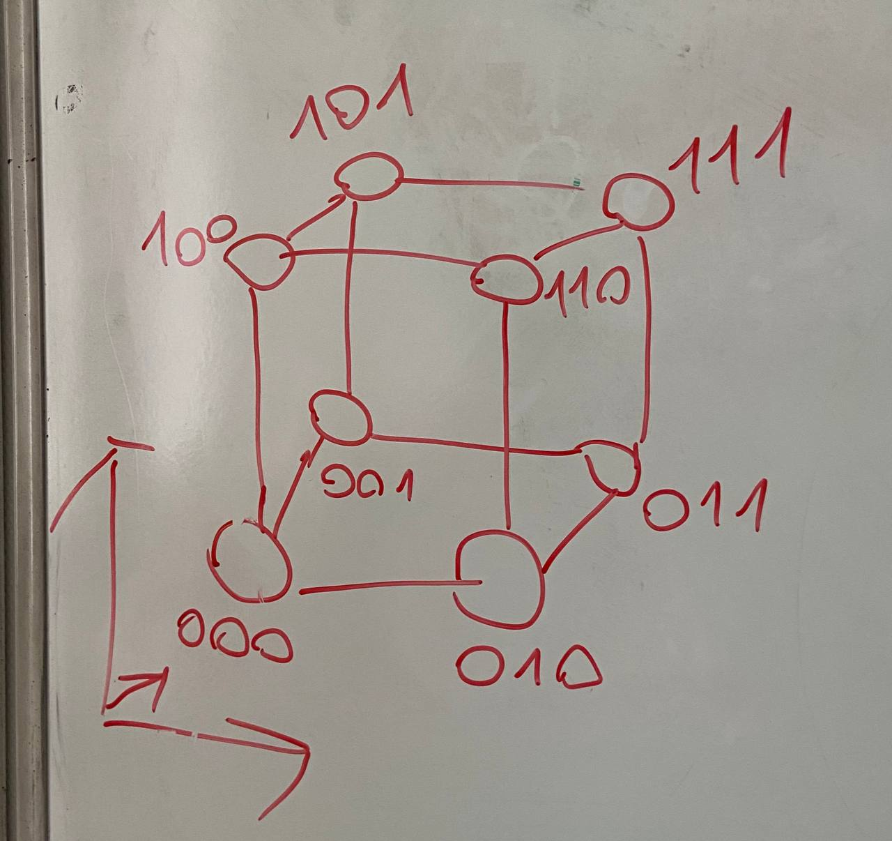
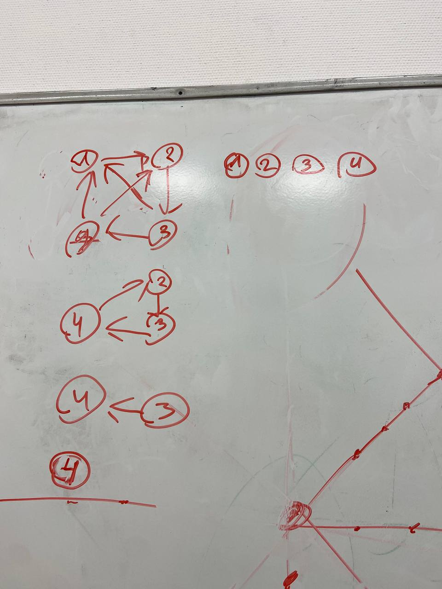

# DZ 15

## 1

пусть у нас есть слово $S_m$ c суммой цифр $m$

когда мы инвертируем 400 символов у нас 

когда $1\to0:\sum++$

$0\to1:\sum--$

пусть при инвертировании у нас $k$ единиц стали нулями тогда $\sum'=\sum-k+(400-k)=400-2k$

значит при при инвертировании 400х цифр четность остается 

тогда нет пути из слова с четной суммой в слова с нечетной

значит граф не связен

## 2

распишем количество вершин на каждой высоте

заметим что все вершины на четных высотах не пересекаются, аналогично для нечетных

в сумме на всех высотах $2n$ вершин

значит сумма четных + сумма нечетных = $2n$

тогда хотя бы одна из этих сумм $\geq n$

и все вершины в этой сумме несмежны

## 3

(пример для n=3)

в нашем булевом кубе придаем каждой вершине свою координату

заметим что кол-во единиц в координатах у соседних вершин отличается на 1, то есть имеет равную четность

тогда вершины с одинаковой четностью точно не связаны между собой

тогда все верщины с четной суммой кидаем в одну долю а с нечетной в другую

## 4

сделаем двудольный граф. Справа прямые слева точки. Слева направо исходит $26\times 7=182$ ребра
а справа налево идет $43\times 4=172$ ребра.

противоречие

## 5

эта ситуация -  двудольный граф

пусть в А классе $k$ учеников, тогда в Б $26-k$

пусть каждый подрался с каждым (если что сделаем так чтобы не подрались)

тогда получилось условие

$k(26-k)\geq 169$

$26k-k^2\geq169$

$k^2-26k+169\leq 0$

$(k-13)\leq 0$

такое может быть только если в обоих классах по 13 учеников

## 6

да

докажем что степень прихода в каждую вершину равна 1

предположим противное: степень прихода = 0

тогда в эту вершину нельзя добраться

тогда пусть степень хотя бы два, тогда можно добраться в эту вершину из двух других вершин, причем из одной из них можно добраться в другую, тогда в эту вершину есть как минимум два простых путя(противоречие)

итак степень прихода в каждую вершину 1, и все вершины в одной компоненте связности(иначе нельзя было из каждой добраться в каждую) тогда вершины образуют кольцо

в кольце степень исхода из каждой верщины 1, чтд

## 7

докажем по индукции: будем удалять по одной вершине

ШАГ:

если есть вершина из которой все исходят, то она будет в начале пути этого подграфа запоминаем и удаляем ее

иначе если есть вершина в которую все приходят, то она будет в конце пути подграфа. запоминаем и удаляем

иначе в графе должен быть цикличный гамильтонов путь. запоминаем любую вершину нашего подграфа (она будет началом) и удаляем ее.

----
вообщем у нас был единый простой путь, и удаляя вершины мы просто обрезаем концы этого пути
## 8

возьмем случайное подмножество женщин $|A|$

докажем $|A|\leq E(A)$

заметим что это учловие равносильно $k|A|\leq k (E(A))$ (просто домножили на $k$)

теперь $k|A|$ можно понять как сумма любовных связей этих $|A|$ женщин

а $k(E(A))$ множество любовных связей этих мужчин

так множество любовных связей мужчин содержит в себе все любовные связи с этими женщинами (любовь взаимная в условии), так еще могут любить других

значит выполняется $k|A|\leq k(E(A))\to |A|\leq E(A)$ значит выполняется теорема Холла

чтд