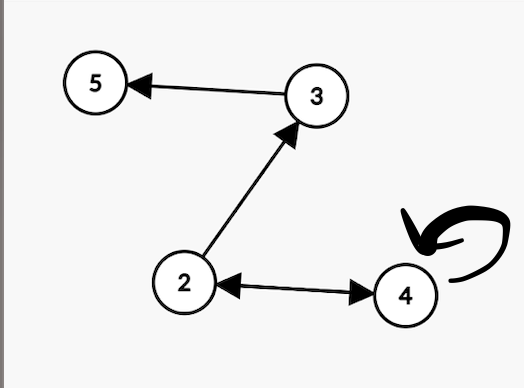
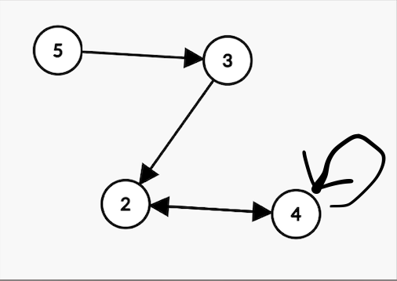
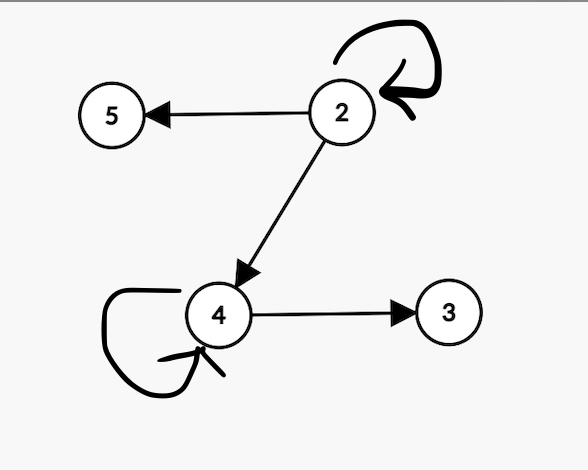

# DZ 3b

## 1

$R = \begin{Bmatrix}(2,3),(3,5),(2,4),(4,2),(4,4)\end{Bmatrix}$

$R$:

$R^{-1}$:

$R \circ R = \begin{Bmatrix}(2,5),(2,2),(2,4),(4,3),(4,4)\end{Bmatrix}$ :

поскольку мы уже знаем $R \circ R$, то  $R \circ R \circ R$ найдем втупую:

$\begin{Bmatrix}(2,3),(3,5),(2,4),(4,2),(4,4)\end{Bmatrix} \circ \begin{Bmatrix}(2,5),(2,2),(2,4),(4,3),(4,4)\end{Bmatrix} = 
\begin{Bmatrix}(2,3),(2,4),(2,2),(4,5),(4,2),(4,4)\end{Bmatrix}$

$dom(R\circ R \circ R) = \begin{Bmatrix}2,4\end{Bmatrix}$

$rng(R\circ R \circ R) = \begin{Bmatrix}2,3,4,5\end{Bmatrix}$

## 2

$A = \begin{Bmatrix}1,2,3\end{Bmatrix}$

$P(A) = \begin{Bmatrix}\emptyset ,\begin{Bmatrix}1\end{Bmatrix},\begin{Bmatrix}2\end{Bmatrix},\begin{Bmatrix}3\end{Bmatrix},\begin{Bmatrix}1,2\end{Bmatrix},\begin{Bmatrix}1,3\end{Bmatrix},\begin{Bmatrix}2,3\end{Bmatrix},\begin{Bmatrix}1,2,3\end{Bmatrix}\end{Bmatrix}$

$C\subseteq\circ\subseteq A \iff \exists B:A\subseteq B \land B\subseteq C \implies A\subseteq C$

подходящие пары $C,$ $A$: 

$\emptyset,\emptyset$

$\emptyset ,\begin{Bmatrix}1\end{Bmatrix}$

$\emptyset ,\begin{Bmatrix}2\end{Bmatrix}$

$\emptyset ,\begin{Bmatrix}3\end{Bmatrix}$

$\emptyset ,\begin{Bmatrix}1,2\end{Bmatrix}$

$\emptyset ,\begin{Bmatrix}1,3\end{Bmatrix}$

$\emptyset ,\begin{Bmatrix}2,3\end{Bmatrix}$

$\emptyset ,\begin{Bmatrix}1,2,3\end{Bmatrix}$

$\begin{Bmatrix}1\end{Bmatrix},\begin{Bmatrix}1\end{Bmatrix}$

$\begin{Bmatrix}1\end{Bmatrix},\begin{Bmatrix}1,2\end{Bmatrix}$

$\begin{Bmatrix}1\end{Bmatrix},\begin{Bmatrix}1,3\end{Bmatrix}$

$\begin{Bmatrix}1\end{Bmatrix},\begin{Bmatrix}1,2,3\end{Bmatrix}$

$\begin{Bmatrix}2\end{Bmatrix},\begin{Bmatrix}2\end{Bmatrix}$

$\begin{Bmatrix}2\end{Bmatrix},\begin{Bmatrix}1,2\end{Bmatrix}$

$\begin{Bmatrix}2\end{Bmatrix},\begin{Bmatrix}2,3\end{Bmatrix}$

$\begin{Bmatrix}2\end{Bmatrix},\begin{Bmatrix}1,2,3\end{Bmatrix}$

$\begin{Bmatrix}3\end{Bmatrix},\begin{Bmatrix}3\end{Bmatrix}$

$\begin{Bmatrix}3\end{Bmatrix},\begin{Bmatrix}1,3\end{Bmatrix}$

$\begin{Bmatrix}3\end{Bmatrix},\begin{Bmatrix}2,3\end{Bmatrix}$

$\begin{Bmatrix}3\end{Bmatrix},\begin{Bmatrix}1,2,3\end{Bmatrix}$

$\begin{Bmatrix}1,2\end{Bmatrix},\begin{Bmatrix}1,2\end{Bmatrix}$

$\begin{Bmatrix}1,2\end{Bmatrix},\begin{Bmatrix}1,2,3\end{Bmatrix}$

$\begin{Bmatrix}1,3\end{Bmatrix},\begin{Bmatrix}1,3\end{Bmatrix}$

$\begin{Bmatrix}1,3\end{Bmatrix},\begin{Bmatrix}1,2,3\end{Bmatrix}$

$\begin{Bmatrix}2,3\end{Bmatrix},\begin{Bmatrix}2,3\end{Bmatrix}$

$\begin{Bmatrix}2,3\end{Bmatrix},\begin{Bmatrix}1,2,3\end{Bmatrix}$

$\begin{Bmatrix}1,2,3\end{Bmatrix},\begin{Bmatrix}1,2,3\end{Bmatrix}$

## 3

$nRk$ : $n$ делит $k$

$nR^{-1}k$ : $n$ делится на $k$

$R^{-1}[A]$ : множество чисел, каждое из которых делит хотя-бы одно число из множества $A$

тогда $R^{-1}[\begin{Bmatrix}12,15,42\end{Bmatrix}] =$

$
\begin{Bmatrix}1,-1,2,-2,3,-3,4,-4,5,-5,6,-6,7,-7,12,-12,14,-14,15,-15,21,-21,42,-42\end{Bmatrix}$

## 4

$R \circ (P\cup Q)\iff \forall a,c \exists b: a(P\cup Q)b \land bRc \iff 
(aPb \lor aQb)\land bRc \iff
(aPb \land bRc)\lor(aQb \land bRc)\iff
(R\circ P)\cup(R\circ Q)$

## 5

нет, например 

$R=\begin{Bmatrix}(1,2),(2,2)\end{Bmatrix}$

$P=\begin{Bmatrix}(0,1)\end{Bmatrix}$

$R=\begin{Bmatrix}(0,2)\end{Bmatrix}$

$(R\circ P) \cap (R\circ Q) = \begin{Bmatrix}(0,2)\end{Bmatrix}$

$R\circ(P\cap Q) = \emptyset$

## 6

нет, например 

$R=\begin{Bmatrix}(1,2),(2,2)\end{Bmatrix}$

$X=\begin{Bmatrix}1\end{Bmatrix}$

$Y=\begin{Bmatrix}2\end{Bmatrix}$

$R[X]\cap R[Y] = \begin{Bmatrix}2\end{Bmatrix}$

$R[X\cap Y] = \emptyset$

## 7

$a \in $(R $\cup$ Q)[X]$ \iff $
$\exists b \in X:(aRb \lor aQb) \iff$
$\exists b \in X: (aRb) \lor \exists b' \in X :(aQb')$
$\iff $ R $[X]$ $ \cup Q[X]$

