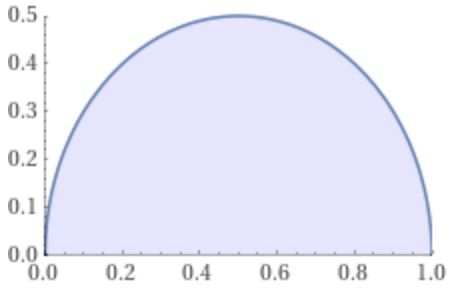

# самостоятельное решение (случайно 1 номер оттуда решил)
## 1

a)

$\displaystyle\lim_{n\to \infty}\sqrt[2^n]{\displaystyle\prod_{k=1}^{2^n}{(1+\frac{k}{2^n})}} = $

$\displaystyle\lim_{n\to \infty}\displaystyle\prod_{k=1}^{2^n}\sqrt[2^n]{{(1+\frac{k}{2^n})}} = $

$\displaystyle\lim_{n\to \infty}\sqrt[4^n]{\displaystyle\prod_{k=1}^{2^n}{(1+\frac{k}{2^n})^{2^n}}} = $

$\displaystyle\lim_{n\to \infty}\sqrt[4^n]{\displaystyle\prod_{k=1}^{2^n}{e^k}} = $

$\displaystyle\lim_{n\to \infty}\sqrt[4^n]{e^{\sum k }} = $

$\displaystyle\lim_{n\to \infty}\sqrt[4^n]{e^{\frac{2^n(2^n+1)}{2} }} = $

$\displaystyle\lim_{n\to \infty}\sqrt[4^n]{e^{2^{n-1}(2^n+1)} } = $

$\displaystyle\lim_{n\to \infty}\sqrt[4^n]{e^{2^{2n-1}+2^{n-1}} } = $

$\displaystyle\lim_{n\to \infty}\sqrt[4^n]{e^{\frac{4^{n}}{2}}e^{\frac{2^n}{2}} } = $

$\displaystyle\lim_{n\to \infty}e^{\frac{3}{2}}\sqrt[4^n]{e^{\frac{1}{4}}} = $

$\displaystyle\lim_{n\to \infty}e^{\frac{3}{2}}\sqrt[4^n+1]{e} = e^{\frac{3}{2}} $

# DZ 13

## 1

a)

$\displaystyle\int^2_1\frac{dx}{x^2} = $

$\displaystyle\lim_{n\to\infty}\displaystyle\sum^{n-1}_{k=0}\frac{1}{(1+\frac{k}{n})^2}\frac{1}{n} =$

$\displaystyle\lim_{n\to\infty}\displaystyle\sum^{n-1}_{k=0}\frac{n}{(n+k)^2}$

$<\displaystyle\sum^{n-1}_{k=0}\frac{n}{(n+k)(n+k+1)}
<$

$\displaystyle\sum^{n-1}_{k=0}\frac{n}{(n+k)^2}
<$

$<
\displaystyle\sum^{n-1}_{k=0}\frac{n}{(n+k)(n+k-1)}$

$\displaystyle\sum^{n-1}_{k=0}\frac{n}{(n+k)(n+k+1)  } = $

$n \displaystyle\sum^{n-1}_{k=0}\frac{1}{n+k}-\frac{1}{n+k+1} = n(\frac{1}{n}-\frac{1}{2n})=\frac{1}{2}$

$\displaystyle\sum^{n-1}_{k=0}\frac{n}{(n+k)(n+k-1)} =$

$ n\displaystyle\sum^{n-1}_{k=0}\frac{1}{n+k-1}-\frac{1}{n+k-1} = $

$n(\frac{1}{n-1}-\frac{1}{2n-1})\to \frac{1}{2}$

по т. о двух миллиционерах наш интеграл равен $\frac{1}{2}$

b)

$\displaystyle\int_{1}^{e}lnxdx = $

$
\displaystyle\lim_{n\to \infty}\displaystyle\sum_{k=0}^{n}ln(1+\frac{e-1}{n}k)\frac{e-1}{n} = $

$
\displaystyle\lim_{n\to \infty}\displaystyle\sum_{k=0}^{n}ln((1+\frac{e-1}{n}k)^{\frac{e-1}{n}}) = $

$
\displaystyle\lim_{n\to \infty}\displaystyle\sum_{k=0}^{n}ln(((1+\frac{e-1}{n}k)^{\frac{n}{e-1}})^{\frac{e-1}{n}^2}) = $

$
\displaystyle\lim_{n\to \infty}\displaystyle\sum_{k=0}^{n}ln((e^k)^{\frac{e-1}{n}^2}) = $

$
\displaystyle\lim_{n\to \infty}\displaystyle\sum_{k=0}^{n}k\frac{(e-1)^2}{n^2}= $

$
\displaystyle\lim_{n\to \infty}\frac{(e-1)^2}{n^2}\displaystyle\sum_{k=0}^{n}k= $

$
\displaystyle\lim_{n\to \infty}\frac{(e-1)^2}{n^2}\frac{n(n+1)}{2}= $

$
\displaystyle\lim_{n\to \infty}\frac{(e-1)^2(1+\frac{1}{n})}{2}= \frac{(e-1)^2}{2}$

## 2

a)

$\displaystyle\lim_{n\to \infty}\frac{1}{n^2}\displaystyle\sum^{n}_{k=1}\sqrt{k(n-k)} = $

$\displaystyle\lim_{n\to \infty}\frac{1}{n}\displaystyle\sum^{n}_{k=1}\sqrt{\frac{k}{n}(1-\frac{k}{n})} = $

$\displaystyle\int_{0}^{1}\sqrt{x(1-x)}dx$

$y=\sqrt{x(1-x)}$

$y^2 = x(1-x)$

$x^2-x+y^2=0$

$x^2-x+\frac{1}{4}-\frac{1}{4}-y^2=0$

$(x-\frac{1}{2})^2+y^2=\frac{1}{4}$

это окружность с центром в точке $(\frac{1}{2};0)$ и радиусом $\frac{1}{2}$ получается нужно посчитать площадь верхнего полукруга

$S =\frac{\pi r^2}{2} = \frac{\pi}{4* 2} = \frac{\pi}{8}$

b)

$\displaystyle\lim_{n\to \infty}(\frac{1}{n+1}+\frac{1}{n+2}+\dots+\frac{1}{3n} )$

$\displaystyle\lim_{n\to \infty}\displaystyle\sum^{n}_{k=1}(\frac{1}{n}) - lnn = \gamma$

постоянная эйлера

тогда

$\displaystyle\lim_{n\to \infty}(\frac{1}{n+1}+\frac{1}{n+2}+\dots+\frac{1}{3n} )  =$

$\gamma + ln3n - \gamma -lnn = ln3$

## 3

a)

$\displaystyle\int sin^4xdx = \frac{sin4x}{32}-\frac{sin2x}{4}+\frac{3x}{8}+C$

$\displaystyle\int_{0}^{2\pi}sin^4xdx = \frac{3\pi}{4}$

b)

$\displaystyle\int\frac{x^2}{1+x^6}dx = $

$\displaystyle\frac{1}{3}\int\frac{dx^3}{1+x^6}dx = $

$\frac{1}{3}arctgx^3+C$

$\displaystyle\int_{0}^{1}\frac{x^2}{1+x^6}dx = \frac{1}{3}(arctg1-arctg0) = \frac{\pi}{12}$

c)

$\displaystyle\int\frac{x}{sin^2x}dx = $

$-\displaystyle\int xdctgx = $

$-(xctgx - \displaystyle\int\frac ctgxdx) = $

$lnsinx-xctgx + C$

$\displaystyle\int_{\pi/4}^{\pi/3}\frac{x}{sin^2x}dx = ln\frac{\sqrt3}{2} - \frac{\pi\sqrt3}{4} - ln\frac{\sqrt2}{2}+\frac{\pi}{4} = ln\sqrt{\frac{3}{2}} +\frac{\pi}{4}(1-\sqrt3)$

d)

$\displaystyle\int xatanxdx = $

$\displaystyle\frac{1}{2}\int atanxdx^2 = $

$\frac{1}{2}(x^2atanx - \displaystyle\int\frac{x^2}{x^2+1}dx) = $

$\frac{1}{2}(x^2atanx - \displaystyle\int1-\frac{1}{x^2+1}dx) = \frac{x^2atanx+ atanx -x}{2}+C$

$\displaystyle\int_0^{\sqrt3} xatanxdx = \frac{4\frac{\pi}{6}-\sqrt3}{2}$

e)

$\displaystyle\int^{3}_{\frac{1}{3}}\frac{atanx}{x^2-x+1}dx = $

$\displaystyle\int^{1}_{\frac{1}{3}}\frac{atanx}{x^2-x+1}dx $

$ + \displaystyle\int^{3}_{1}\frac{atanx}{x^2-x+1}dx= $

$\displaystyle\int^{3}_{1}\frac{atan\frac{1}{t}}{\frac{1}{t^2}-\frac{1}{t}+1}d\frac{1}{t}  $

$+ \displaystyle\int^{3}_{1}\frac{atanx}{x^2-x+1}dx= $

$\displaystyle\int^{3}_{1}\frac{atan\frac{1}{t}}{\frac{t^2-t+1}{t^2}}\frac{1}{t^2}dt  $

$+ \displaystyle\int^{3}_{1}\frac{atanx}{x^2-x+1}dx= $

$\displaystyle\int^{3}_{1}\frac{atan\frac{1}{t}}{t^2-t+1}dt  $

$+ \displaystyle\int^{3}_{1}\frac{atanx}{x^2-x+1}dx= $

$\displaystyle\int^{3}_{1}\frac{\frac{\pi}{2}-atant}{t^2-t+1}dt  $

$+ \displaystyle\int^{3}_{1}\frac{atanx}{x^2-x+1}dx= $

переменим t на x

$\displaystyle\int^{3}_{1}\frac{\frac{\pi}{2}}{x^2-x+1}dx $

$ -\displaystyle\int^{3}_{1}\frac{atanx}{x^2-x+1}dx $

$ + \displaystyle\int^{3}_{1}\frac{atanx}{x^2-x+1}dx= $

$\displaystyle\int^{3}_{1}\frac{\frac{\pi}{2}}{x^2-x+1}dx  = $

$\frac{\pi}{2}\displaystyle\int^{3}_{1}\frac{1}{x^2-x+1}dx = $

$\frac{\pi}{2}\displaystyle\int^{3}_{1}\frac{d(x-\frac{1}{2})}{\frac{3}{4} + (x-\frac{1}{2})^2} = $

$\frac{\pi}{2}(\frac{2\sqrt3}{3}arctg\frac{2(x-
\frac12)}{\sqrt3})|^{3}_{1} = $

$\frac{\sqrt3\pi}{3}(atan\frac{5\sqrt3}{3}-\frac{\pi}{6})$

f)

$\displaystyle\int\frac{dx}{4+cos^2x} = \frac{\sqrt5arctg(\frac{2\sqrt5tgx}{5})}{10}+C$

$\displaystyle\int^{2\pi}_{0}\frac{dx}{4+cos^2x}  = 0 - 0 = 0$

## 4

a)

$\displaystyle\int^{1/2}_{0}6x^2-6x+1 - cos\pi xdx =$

$ 2x^3 -3x^2+x - \frac{sin\pi x}{\pi}|^{1/2}_{0} =$

$
\frac{1}{4}  -\frac{3}{4}+\frac{1}{2} - \frac{\sqrt3}{2}  =$

$ -\frac{\sqrt3}{2\pi}$

b)

$\displaystyle\int\frac{x^2}{2}dx - \displaystyle\int\frac{1}{1+x^2}dx= \frac{x^3}{6} - arctgx$

c)

$\begin{cases}
x^2+y^2=4\\\\
2y = x^2
\end{cases}$

$\sqrt{4-x^2} = \frac{x^2}{2}$

$4-x^2= \frac{x^4}{4}$

$16-4x^2=x^4$

$x^4+4x^2-16=0$

$D = 16+64 = 80$

$x^2 = \frac{-4\pm4\sqrt5}{2} = -2\pm2\sqrt5$

$a = -\sqrt{2\sqrt5-2}$

$b = \sqrt{2\sqrt5-2}$

$S = \displaystyle\int^{b}_{a}\sqrt{4-x^2}dx - \displaystyle\int_a^b\frac{x^2}{2}dx = $

$\frac{x\sqrt{4-x}}{2}+2arcsin{x/2} - \frac{x^3}{6}|^{b}_a$

d)

$S = \displaystyle\int_0^2\frac{5x}{2}dx - \displaystyle\int_0^1 x^2+x-1dx - \displaystyle\int_{1}^2x^2dx = $

$\frac{45}{4} +\frac{1}{6} - \frac{7}{3} $

e)

$\displaystyle\int sinx\sqrt{cosx}dx = $

$ - \displaystyle\int \sqrt{cosx}dcosx = $

$ - \displaystyle\int \sqrt{t}dt = $

$-\frac{3t\sqrt t}{2} = -\frac{3cosx\sqrt{cosx}}{2}$

$S = 4 * \displaystyle\int^{\pi/2}_{0}sinx\sqrt{cosx}dx = $

$-6cosx\sqrt{cosx}|^{\pi/2}_{0} = 6$