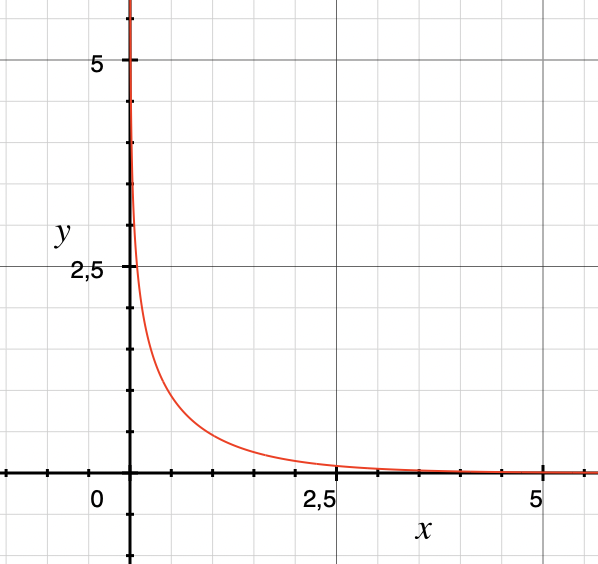
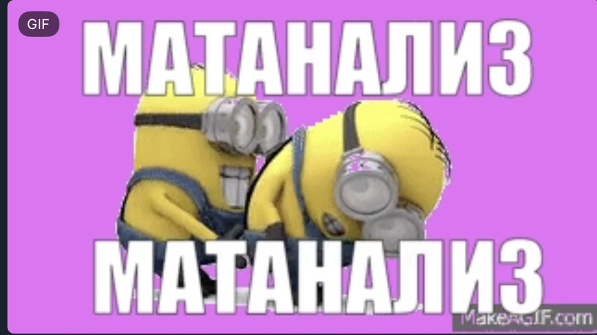

# DZ 9

## 1

a)

$\begin{cases}
x = ln(1+e^{-t})\\\\
y = ln(1+e^{t})
\end{cases}$

обе функции непрерывны и строго монотонны

$e^y = 1+e^{t}$

$t=ln(e^y-1)$

$\to y(x)=ln(1+e^{-ln(e^x-1)})=ln(1+\frac{1}{e^x-1})=ln(\frac{e^x}{e^x-1})$

функция непрерывна на интервале $(0;+\infty)$

b)

$\begin{cases}
x = \frac{1}{4}(t-t)e^t\\\\
y = \sqrt t e^t
\end{cases}$

обе функции непрерывны и строго монотонны на интервале $(0;+\infty)$, поэтому образуют единственную функцию $x(y)$ непрерывную на интервале $(0;+\infty)$

## 2

a) ан выбранном отрезке x - монотонна и непрерывна, y - непрерывна, значит y(x) непрерывна, тогда 

$y'(x) = \frac{y'}{x'} = \frac{acost}{-bsint} = -\frac{a}{b}ctg(t)$

b)

на выбранном отрезке x - монотонна и непрерывна, y - непрерывна, значит y(x) непрерывна, тогда 

$y'(x) = \frac{y'}{x'} = \frac{((t-1)^2(t-2))'}{((t-1)^2(t-3))'}=\frac{(t^3-4t^2+5x-2)'}{(t^3-5t^2+7t-3)'}=\frac{3t^2-8t+5}{3t^2-10t+7} = \frac{(t-1)(3t-5)}{(t-1)(3t-7)}=\frac{3t-5}{3t-7}$

## 3

$x$ непрерывна и строго монотонна на данном интервале, $y$ непрерывна на данном интервале $\to$ $y(x)$ непрерывна на интервале

$y'(x) = \frac{y'}{x'}=\frac{\frac{1}{sint}cost}{\frac{1}{sin\frac{t}{2}}cos\frac{t}{2}\frac{1}{2}}=2\frac{ctgt}{ctg\frac{t}{2}}$

экстремум достигается в точке $t_0=\frac{\pi}{2}$

## 4

$\begin{cases}
x=\frac{1+t}{t^3}\\\\
y=\frac{3+t}{2t^2}
\end{cases}$

х монотонно возрастающая непрерывная функция

y непрерывная функция 

значит $y(x)$ непрерывна

$\frac{1+t}{t^3}=2$

$2t^3-t-1=0$

$t_0=1$

$k=y(x)'=\frac{y'}{x'} = \frac{(2t^2-4t(3+t))(t^6)}{(4t^4)(t^3-3t^2(1+t))} = \frac{t^2(-5t^2-2t)}{2(-2t^3-3t^2)}=\frac{(5t+2)t}{2t+3}$

уравнение касательной :

$y=k(x-t_0) +2 = \frac{(5t+2)t}{2t+3}(x-1)+2$

уравнение нормали : 

$y = -\frac{2t+3}{(5t+2)t}(x-1)+2$

## 5

$\begin{cases}
x = \frac{1}{t(t+1)}\\\\
y = \frac{(t+1)^2}{t}
\end{cases}$

$x' = \frac{-1}{(t^2)(t+1)}+\frac{-1}{(t+1)^2t} = -\frac{2t+1}{t^2(t+1)^2}$

интервалы монотонности: $(-\infty;-1),(-1;-1/2),(-1/2;0),(0;+\infty)$

$y' = -\frac{2t+2}{t^3}$

интервады монотонности : $(-\infty;-1),(-1;0),(0,+\infty)$

$x''=\frac{6\,{t}^{2}+6\,t+2}{{t}^{6}+3\,{t}^{5}+3\,{t}^{4}+{t}^{3}}$

$y''=\frac{4\,t+6}{{t}^{4}}$

у второй функции меньше интервалом монотонности, поэтому будем рассматривать $x(y)$

$x'(y)=\frac{(2t+1)t}{2(t+1)^3}$

$x''(y)=\frac{x''y'-y''x'}{(y')^3}=\frac{-\frac{6\,{t}^{2}+6\,t+2}{{t}^{6}+3\,{t}^{5}+3\,{t}^{4}+{t}^{3}}\frac{2t+2}{t^3}+\frac{4\,t+6}{{t}^{4}}\frac{2t+1}{t^2(t+1)^2}}{(-\frac{2t+2}{t^3})^3}=\frac{-2t^5+2t^4+t^3}{4t^5+20t^4+40t^3+40t^2+20t+4}$

$\frac{t^3(t-\frac{1-\sqrt3}{2})(t-\frac{1+\sqrt3}{2})}{4(t-1)^5}$

корни : $0,\frac{1-\sqrt3}{2},\frac{1+\sqrt3}{2}$

интервал $(-\infty;-1)$:

$x:\displaystyle\lim_{t\to-\infty}\frac{1}{t(t+1)}=+0$

$y:\displaystyle\lim_{t\to-\infty}\frac{(t+1)^2}{t^2}=+\infty$

$x:\displaystyle\lim_{t\to-1}\frac{1}{t(t+1)}=+\infty$

$y:\displaystyle\lim_{t\to -1}\frac{(t+1)^2}{t^2}=+0$

экстремумов нет

точек перегиба нет

 интервал $(-1;0)$

$x:\displaystyle\lim_{t\to+-1}\frac{1}{t(t+1)}=+\infty$

$y:\displaystyle\lim_{t\to+-1}\frac{(t+1)^2}{t^2}=0$

$x:\displaystyle\lim_{t\to-0}\frac{1}{t(t+1)}=-\infty$

$y:\displaystyle\lim_{t\to -0}\frac{(t+1)^2}{t^2}=1+\frac{2}{t}+\frac{1}{t^2}=+\infty$

экстремумы : $t_0=-1/2$

$x_0=\frac{1}{-1/2*-3/2}=4/3$

$y_0=\frac{1/4}{1/4}=1$

ААААА я потратил на этот номер уже часа 4, раза 3 понимал что у меня арифметическая ошибка в самом начале  и начинал делать заново и вот снова несостыковочка, наверняка из-за какой-то ошибки я все богдан прости

